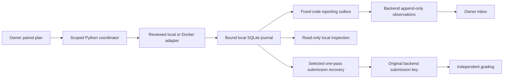
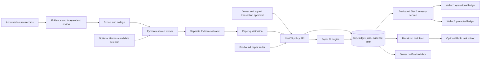
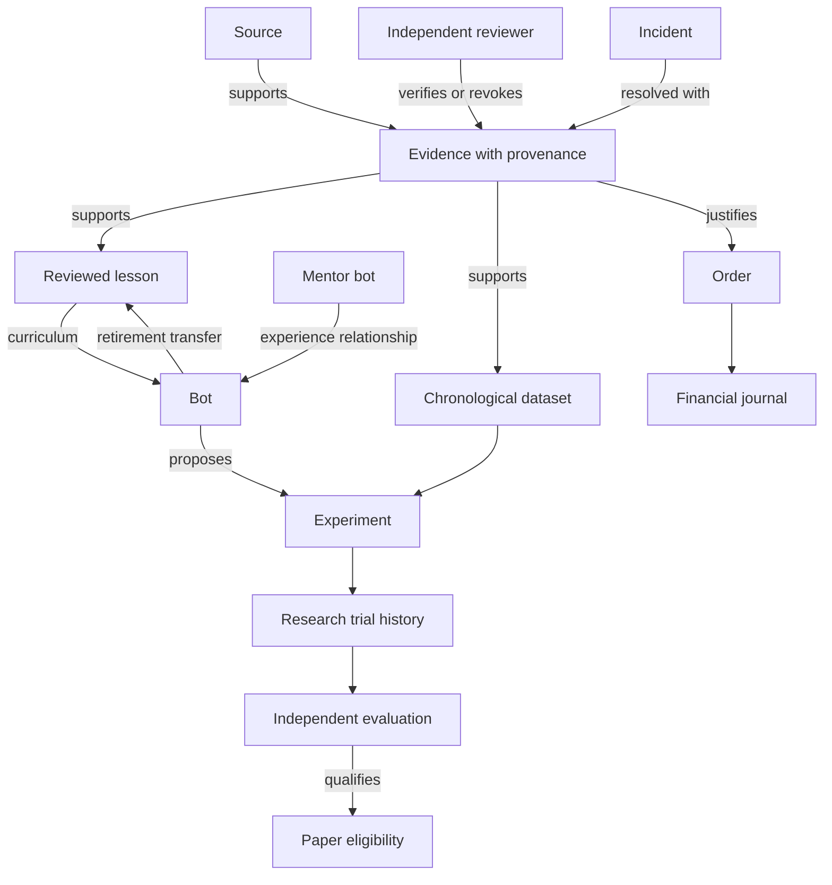

# Architecture and runtime knowledge graph

## Shared inference and organisation growth — v0.1.32

Bots keep distinct identities, reviewed context and outcome histories while sharing a bounded model endpoint. Financial arithmetic and authority remain deterministic. [Model strategy](model-strategy.md) maps the target learning loop, specialist numerical workers and role-specific fitness; it explicitly labels the unfinished autonomous stages. See [current status](current-status.md) for implemented boundaries.

> [Current implementation, validation and limits](current-status.md) is the current status index (v0.1.32). Dated milestones and design proposals retain their original scope.

## Execution evidence and recovery flow

Recovery never routes back to solver execution. Local snapshots and authenticated observations do not attest execution or liveness. Grading still cannot approve releases. See [current boundaries](current-status.md) and [recovery](artifact-recovery.md).

## Ownership of decisions

The application core owns the rulebook and authoritative state. Research workers propose candidates. Evaluators test them with separate credentials and holdout access. A qualified bot may request a paper order; the core independently checks authority, evidence, quote freshness, capital reservations and current limits. No model answer can move money directly.

Both integrations are outside the financial execution path. The default demo requires neither one. In this release the market principal supplies quotes and the trader requests orders explicitly; there is no background scheduler that turns news or candidate signals into unattended trades.

## Code map

| Module | Responsibility |
| --- | --- |
| `backend/src/security.ts` | Scoped bearer authentication, role checks and signed transaction challenges. |
| `backend/src/database.ts` | SQL transactions, migration checksums, idempotency, audit and notifications. |
| `backend/src/treasury.ts` | Contributions, expenses, owner transfers, ledger and distribution obligations. |
| `backend/src/organisation.ts` | Sources, evidence, lessons, academy transitions and retirement. |
| `backend/src/research.ts` | Datasets, experiments, worker leases, evaluation and coordination feed. |
| `backend/src/paper.ts` | Quote checks, reservation, fills, positions and risk limits. |
| `backend/src/operations.ts` | Incident containment, resolution, resume and owner reporting. |
| `services/research/worker.py` | Deterministic momentum search and independent numerical evaluation. |
| `integrations/hermes` | Pinned Hermes interface with no tools and bounded output. |
| `integrations/ruflo` | Allowlisted local MCP client and durable application-to-task mapping. |

## Knowledge graph in this release

The graph is represented by explicit SQL relationships and retrieved through `/v1/knowledge`, bot records and experiment reports. A graph database, embeddings and automatic causal inference are not required for these initial relationships and are not implemented.

An evidence review records a trusted identity's decision; it does not automatically prove the content true. Revocation removes affected material from usable knowledge and prevents invalid support from authorising new risk. Original records remain for diagnosis. This preserves learning without treating rejected claims as accepted knowledge.

## Transactions and recovery

All application commands serialize on a database row lock. Business changes, journal entries, idempotency results, audit events and inbox records commit together. This deliberately favours correctness for the first release; it is not a low-latency DEX engine. PostgreSQL is supported through `pg`, but validation here used PGlite. Multiple-server deployment and concurrent migrations require a separate rollout test.

Worker claims have 120-second leases and a maximum of three attempts. Repeated claims by the same worker return its existing unexpired lease. Completions are tied to worker identity and lease token. Temporary HTTP failures use bounded retries with the original result and idempotency key. An abandoned lease can be reclaimed; exhausting the retry budget records an incident. These are explicit recovery actions, not arbitrary autonomous code repair.

## Academy interpretation

`school → college → paper → retired` is a persisted lifecycle. School uses reviewed lessons; college runs an approved strategy experiment. Qualification is intentionally narrow: positive net holdout return above a cash baseline with bounded drawdown. It is a software integration gate, not a sufficient investment evaluation protocol.

Uniqueness currently means a case-insensitive `(department, specialty, method)` declaration. It does not establish semantic novelty. Ordinary bots retain owner-controlled creation, school admission and retirement. Version 0.1.4 adds the [bounded research lifecycle](research-lifecycle.md): the owner approves capability blueprints and an optional policy; a cycle can then admit and archive managed example-research students. This code is not yet run. Those students have zero budget and cannot enter paper trading. Future evaluation must measure contribution to a department: a risk monitor may be valuable because it prevents losses even if it never generates trading revenue.

The new graph adds `approved blueprint → managed student → reviewed curriculum → evaluated portfolio trials → lifecycle review → reputation/designation → retirement archive`. Blueprint, review, archive and original trial records remain linked. Current reputation excludes revoked evidence, while immutable historical reviews preserve the original decision context. A lifecycle worker is an explicit, bounded clock; no model or process is spawned merely by inserting a student record.

<!-- documentation-navigation -->
[Documentation index](documentation-index.md) · Documentation reconciled for v0.1.32 on 6 October 2026; historical records retain their original scope.
