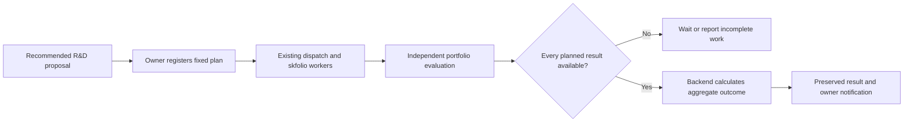

# Registered R&D experiments

> Documentation refreshed for v0.1.21 (5 October 2026). [Current implementation, validation and limits](current-status.md). Dated milestones and design proposals retain their original scope.

Version 0.1.8 adds a fixed experiment plan between a recommended Hermes proposal and any future recruitment decision. Source, migration 009 and four regression cases are written; no build, migration, tests or workers have been run for this increment.

## What happens



The owner chooses an existing managed college bot, 3–12 verified example datasets, an operational definition and thresholds. The bot's method must match the proposal. Datasets must already belong to the owner's dispatch pool. Each proposal may have only one registered experiment and each bot may have one unassessed, uncancelled experiment. There is a hard lifetime limit of 100 plans, including cancelled plans; no unattended expansion of this limit is implemented.

Registration fixes the complete window set before its assignments/results. Holdout periods must be disjoint. Any period previously assigned, submitted or registered in an R&D experiment is rejected across bots, assets and methods, including failed/cancelled records. Each dataset's training cutoff must be at least the proposal's context cutoff. These conservative rules prevent reusing observed research periods for a newly registered experiment.

Registration does not itself enable a policy, start a worker, prioritise or reserve queue entries, or increase an assignment allowance. Existing dispatch handles the approved pool in chronological order under its normal fairness and quotas. To focus a session on the experiment, the owner can deliberately configure its datasets in the dispatch pool. Other bots may still research the same periods after registration: this release is not a globally blinded experiment scheduler. It also does not establish point-in-time source availability or prove that an operator never inspected the example data. Use a controlled research environment when stronger isolation is required.

## Assessment

The evaluator department calls `/development/experiments/cycles` after portfolio and memory review, before lifecycle/dispatch. No separate model call is needed. It assesses only portfolio trials linked through the selected bot's existing research assignments, with both assignment and submission dates at or after registration. All planned windows must have evaluated results. Failed/cancelled work produces `incomplete-work`; missing work produces `awaiting-results`. No worst window is dropped and no result is fabricated to complete a plan.

The backend calculates an equally weighted mean of per-window `rewardBps`, the largest reported per-window drawdown, and the number of strictly positive rewards. This is a diagnostic aggregate, not a concatenated equity curve or statistical significance test. The immutable owner thresholds are:

- `minMeanRewardBps`: 0–10,000, inclusive.
- `maxDrawdownBps`: greater than zero, at most 10,000.
- `minPositiveWindows`: at least one, no greater than the number of planned windows.

All three must pass for `supported-for-further-research`; otherwise the outcome is `not-supported`. In particular, equal-weight matching its baseline in every window has zero positive windows and cannot pass. Neither outcome grants recruitment, trading authority or another fitness reward. The existing lifecycle may independently use its ordinary trial assessments; the R&D aggregate never adds to those rewards.

The aggregate evaluator must differ from the proposal author, plan approver and every trial author. Individual portfolio evaluations must also be independent of their trial authors. Global halt stops registration and assessment; owner cancellation remains available. Pausing model inference does not stop an already authorised diagnostic plan or its ordinary research workers. Existing lifecycle/dispatch switches control new research execution.

Source and memory/model revocations block pending assessment. Read-only status rechecks them using `supportCurrent`, even after a result has been recorded. A historical result remains immutable after withdrawal and must not be interpreted as currently supported merely because its old outcome was positive. Changing source approval can restore current support, but does not erase the history.

Cancellation closes the aggregate plan and retains its consumed windows. It does not cancel research assignments or submitted trials: those remain governed by the existing dispatch/portfolio cancellation APIs, and can still contribute to the ordinary lifecycle. The report exposes their states. A plan that becomes impossible after a bot retires needs owner cancellation; retirement is not blocked indefinitely by a diagnostic plan.

## Meaning of a hypothesis

The owner records how the proposed idea maps to a measurable diagnostic experiment. Only the three existing portfolio methods can run. Hermes prose is not compiled into executable strategy code; a new regime detector or data transformation described in prose does not start working because it appears in a plan. The worker uses its existing fixed fitting algorithm. Backend method labels and validated weights are not independent attestation of which fitting code produced them. Passing this gate supports only the recorded example diagnostics, not the whole natural-language hypothesis, semantic novelty, new skills or profitable trading.

## Owner commands

After rebuilding and restarting the server (startup applies migration 009):

```powershell
npm run lifecycle:admin -- experiments
npm run lifecycle:admin -- report
```

Copy `docs/examples/development-experiment.json` to `.local/development-experiment.json`. Replace the placeholder IDs with a recommended request, an eligible managed bot and three or more approved datasets; review the definition and thresholds. Register it:

```powershell
npm run lifecycle:admin -- experiment .local/development-experiment.json
```

With curriculum, dataset pool and lifecycle/dispatch policies configured, the existing bounded worker session can produce and assess the planned work:

```powershell
npm run worker:organisation -- --minutes 30
```

No new dependencies, model credentials or provider calls are required to assess existing results. Creating the prior Hermes proposal still requires the configuration described in [learning and development](learning-and-development.md).

To cancel an unassessed plan, use `lifecycle:admin -- cancel-experiment <file>` with `{ "experimentId": "UUID", "reason": "Reason" }`. Cancellation does not free its windows for another experiment. Commands use the existing role credentials and idempotency receipts; the API does not accept researcher changes to a plan.

## API

Paths are under `/v1`. All POSTs require an idempotency key.

| Route | Role | Purpose |
| --- | --- | --- |
| GET `/development/experiments` | Owner/evaluator | Fixed plans, window progress, historical outcomes and current support. |
| POST `/development/experiments` | Owner | Register a fixed plan before research. |
| POST `/development/experiments/cycles` | Evaluator | Assess complete pending plans, without additional fitness or recruitment. |
| POST `/development/experiments/cancellations` | Owner | Close an unassessed plan while retaining its history. |

The organisation report includes registered, pending, historically supported, not-supported and cancelled totals. These are historical counts, not revalidated qualifications; use experiment status for current support. Registration, assessment and cancellation create audit events and durable owner-inbox notifications. No email or push delivery is added.

## Next work

Owner-run verification is pending. The next capability stages are executable experiment specifications for genuinely new techniques, protected evaluation datasets and contamination controls, statistical/novelty assessment, then a separate evidence-based recruitment or curriculum proposal. This increment deliberately does not turn a positive example diagnostic into automatic deployment.
