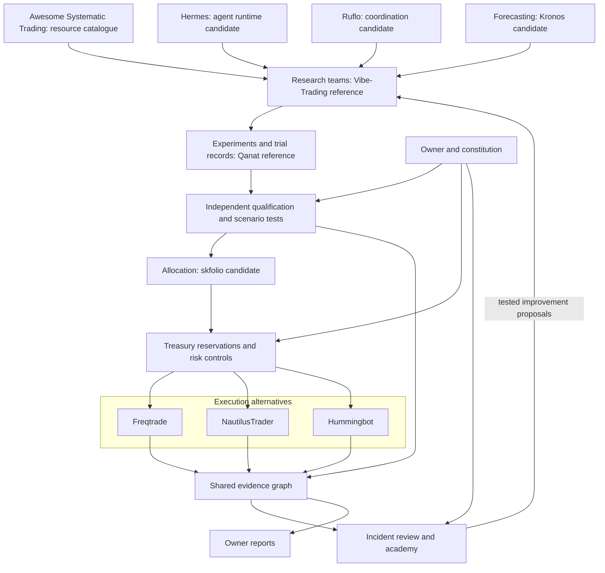
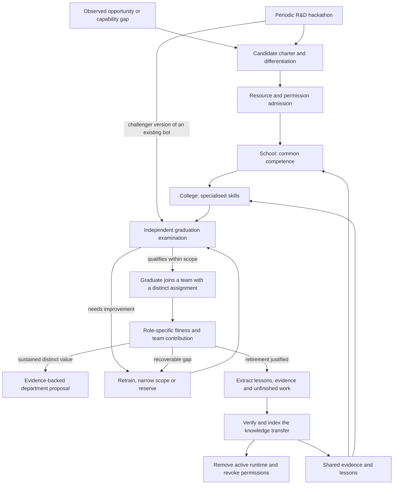
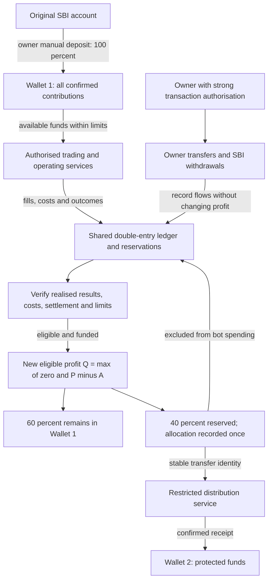

# Knowledge Graph

> Documentation refreshed for v0.1.21 (5 October 2026). [Current implementation, validation and limits](../current-status.md). Dated milestones and design proposals retain their original scope.

## Implemented execution subgraph (v0.1.21)

Owner plan → reviewed artifact declaration → bounded runner → local journal → fixed-code outbox → backend observation → owner inbox. The journal also feeds read-only inspection and selected saved-submission recovery. Backend submission → independent grading remains separate from worker claims; there is no edge granting automatic release or financial authority. See the implemented [architecture](../architecture.md); the broader diagrams below remain design proposals.

[Home](README.md) · [Repository map](07-repository-map.md) · [Decision process](04-research-and-decisions.md)

## Purpose and status

The graph connects requirements, capabilities, evidence, decisions, outcomes, and lessons. It should answer both "how does the organisation work?" and "why did this particular action occur?"

The diagrams below are proposals. Arrows between projects do not claim that those integrations already exist.

## Organisation and repository references

The text equivalent is: source discovery and forecasting support research; experiments feed qualification; qualified strategies inform allocation; treasury controls constrain execution; outcomes feed evidence, review, education, and owner reporting.

For arbitrage, the portfolio role may allocate inventory and strategy budgets rather than rebalance a directional asset portfolio. Each strategy family requires an appropriate simulation and execution model.

## Evidence relationships

```mermaid
flowchart LR
    Source -->|publishes| Observation
    Observation -->|supports or contradicts| Claim
    Claim -->|motivates| Hypothesis
    Hypothesis -->|tested by| Experiment
    Experiment -->|uses| Versions["Data, model, strategy and cost versions"]
    Experiment -->|produces| Result
    Result -->|assessed by| Evaluation["Evaluator and rule version"]
    Evaluation -->|qualifies| Bot["Bot or strategy version"]
    Bot -->|proposes| Decision
    Decision -->|authorised by| Policy["Policy and capital reservation"]
    Decision -->|produces| Order
    Order -->|results in| Outcome["Fill, rejection or unresolved state"]
    Outcome -->|may trigger| Incident
    Incident -->|supports| Lesson
    Lesson -->|proposes| Change
    Change -->|verified by| Test
```

## Node types

| Node | Minimum information |
|---|---|
| Requirement or policy | ID, owner authority, version, effective dates, scope, status. |
| Source | Original location, publisher, retrieval method, reliability history, applicable licence/access conditions. |
| Observation | Instrument/event, value and units, event time, publication time, received time, source ID. |
| Claim or hypothesis | Statement, scope, author, supporting and contradicting evidence, uncertainty, invalidation conditions. |
| Dataset version | Time coverage, availability timestamps, transformation lineage, snapshot/hash, known limitations. |
| Model or strategy version | Artifact identity, configuration, training cutoff where known, dependencies, applicable market and horizon. |
| Experiment | Predeclared hypothesis, versions, data split, execution/cost assumptions, result locations, all attempted variants. |
| Evaluation | Evaluator version, criteria, evidence, pass/fail/defer result, scope, unresolved concerns. |
| Decision | Evidence IDs, alternatives, selected action, limits, expiry, concise rationale, dissent. |
| Order and outcome | Decision ID, venue, reservation, requested terms, acknowledgement/fill state, actual costs. |
| Incident and lesson | Timeline, evidence, causal findings, corrective proposals, applicability and verification status. |

## Edge properties

Relationships should carry IDs, creation time, originating agent or process, evidence references, validity interval, and status. An inferred relationship must be labelled inferred. Confidence estimates require a documented method; arbitrary confidence numbers should not be presented as calibrated probabilities.

Useful statuses include proposed, observed, disputed, tested, qualified, superseded, and invalidated. Qualification is scoped to a version, market, horizon, and permission set.

## Corrections and historical truth

Do not silently overwrite a conclusion. Append a correction or superseding record, preserve the original, and find downstream decisions that relied on it. Distinguish what is known now from what was available when a decision was made.

Private credentials belong outside the knowledge graph. Store references to authorised services, not secrets.

## Example questions the graph should answer

- Which evidence and policy allowed this trade?
- Were the confirming reports independent or copies of one source?
- Which active strategies rely on a corrected data item?
- Which rejected experiments preceded this successful result?
- What qualified this bot version for its current permissions?
- Did the remedy for an incident pass its regression test?
- Which conclusions would change if a key assumption failed?

A graph database is not yet selected. The logical records and relationships should be defined before choosing storage technology.

## Bot capability, growth, and retirement graph

Growth requires an authorised resource envelope. A department proposal passes a separate policy and value review; a high individual score is not automatic approval. The knowledge record outlives an active bot identity.

## Additional node and edge types

| Relationship | Meaning |
|---|---|
| Opportunity → motivates → Candidate charter | The proposed bot has an identified purpose. |
| Candidate → inherits → Skill/lesson version | Reused experience has explicit lineage. |
| Candidate → differs_from → Existing capability | The proposed contribution or workload partition is recorded. |
| Hackathon → produces → Hypothesis/candidate/change | Competition outputs feed normal qualification. |
| Graduation review → qualifies → Bot version | The approved role, tools, resource limits, and review conditions are explicit. |
| Bot → assigned_to → Work item/department | Work ownership and overlap can be checked. |
| Fitness assessment → considers → Role baseline/team effect | Selection is not based on raw profit or agreement alone. |
| Department proposal → justified_by → Validated opportunity/value | Team expansion has evidence and authority. |
| Retirement → requires → Verified transfer | Useful knowledge and unfinished work are addressed before decommissioning. |
| Transfer → preserves → Lessons/negative results/artifacts | Reuse includes failed approaches and their limits. |
| Incident → triggers → Recovery attempt → Verification | An attempted repair is distinguished from a verified recovery. |
| Notification → reports → Incident/recovery/owner decision | The owner can trace what happened and what remains unresolved. |
| Deployment artifact → depends_on → Package/model/service | Repository availability is separated from runtime service availability. |

For bot versions, add parent/mentor IDs, charter, capability scope, inherited evidence IDs, graduation record, assigned work, fitness history, and lifecycle status. A model or process clone is not independent evidence.

## Traceability examples

- Why was this bot created, and how does its contribution differ from its mentor?
- Did a hackathon winner pass the same independent examination as other candidates?
- Which retired bot supplied a lesson, and under which conditions is it valid?
- Does a proposed department add value after its resource and coordination costs?
- Was a failure actually repaired, or did the system merely restart?
- Can this deployment be restored if the original GitHub repository is unavailable?

See [R&D lifecycle](11-research-development-and-bot-lifecycle.md), [recovery](10-autonomous-recovery-and-notifications.md), and [independence](09-runtime-and-independence.md).

## Financial authority and allocation

The graph separates financial infrastructure from learning bots. All confirmed owner deposits enter Wallet 1. Verified new profit is allocated only once: 60% retained and 40% reserved for transfer. Pending amounts are not reported as confirmed Wallet 2 cash. Owner-authorised transfers can move money in either direction or withdraw to SBI, subject to available funds; bots cannot perform those owner actions.

| Relationship | Meaning |
|---|---|
| Contribution → credits → Wallet 1 | Principal is recorded separately from earnings and never automatically split. |
| Realised result/cost → contributes_to → Cumulative P/L | Events have source identities, recognition times, and correction lineage. |
| Allocation → consumes → Eligible profit base | Both shares count toward A; the same profit cannot be allocated again. |
| Allocation → creates → Wallet 2 obligation | Reserved funds are unavailable to bots while payment is pending. |
| Transfer → settles → Obligation | Provider evidence establishes the outcome; retries refer to the same obligation. |
| Reservation → constrains → Available Wallet 1 funds | Multiple bots and departments share one authoritative capacity calculation. |
| Owner approval → authorises → Specific transfer | Amount, source, destination, expiry, and one-time use are enforced. |
| Owner transfer → preserves → Profit/allocation history | Contributions, withdrawals, and internal movements do not reset P or A. |
| Department budget → limits → Operating commitment | Retained profit does not itself authorise expansion. |

New financial records need currency, exact amounts, source event IDs, policy versions, timestamps, ledger references, external references, state, and linked corrections. Credentials remain outside the graph.

See [wallet and treasury](12-wallet-and-treasury.md), [financial scenarios](13-financial-scenarios.md), and the [reconciliation template](templates/financial-reconciliation.md).
