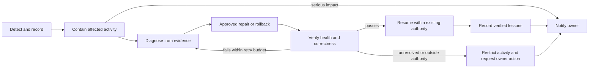

# Autonomous Recovery and Notifications

> [Current implementation, validation and limits](../current-status.md) is the current status index (v0.1.32). Dated milestones and design proposals retain their original scope.

## Implemented subset (v0.1.21)

Bounded lease/HTTP recovery, owner inbox records, artifact reporting outbox, scoped saved-submission replay and one-pass recovery of selected journals are implemented. Container ownership cleanup is implemented but live Docker testing remains deferred. These are specific recovery procedures, not unrestricted self-repair, code changes, permission changes or guaranteed fault-free operation. See [commands and limits](../artifact-recovery.md).

[Home](README.md) · [Governance](06-governance-and-capital.md) · [Incident template](templates/incident-review.md)

## Owner requirement

The organisation should detect problems, resolve them itself where possible, and notify the owner. Routine supervision should not require the owner to repair every failure.

This is bounded autonomy. No system can guarantee zero faults or resolve every condition without help. A problem outside authorised actions or available evidence must be contained and escalated.

## Proposed recovery process

A successful command, new process ID, or green status message is insufficient evidence of recovery. Verification must test the affected capability and check whether data, task, and permission state remain consistent.

## Recovery classes

| Problem | Example bounded response | Verification |
|---|---|---|
| Temporary service failure | Retry with bounded backoff or use an approved equivalent provider. | Current data/results arrive and quality requirements still hold. |
| Stale or inconsistent data | Quarantine affected input and restrict dependent decisions. | Provenance, freshness, and consistency checks pass. |
| Worker crash | Restart from a known checkpoint and reconcile task ownership. | No duplicate work, missing result, or conflicting active owner. |
| Faulty update | Roll back to a previously qualified version. | Regression and compatibility checks pass; state migrations remain valid. |
| Resource pressure | Reduce parallel work or defer lower-priority experiments. | Critical services recover within resource limits. |
| Suspected incorrect lesson/model | Restrict its use and route a challenger or correction through evaluation. | Independent evidence supports replacement or restoration. |
| Unknown side-effect state | Reconcile with the authoritative service before retrying. | The original action's actual outcome is established. |
| Permission or credential failure | Stop affected activity and report the missing authority. | Legitimate access is restored through an authorised process. |

Changing a provider may change semantics, timeliness, or costs. An alternative must be approved for the task; availability alone does not make it equivalent.

## Permission boundary

Autonomous repair can use only a defined action set, resource budget, and scope. It must not grant new privileges, disable protective controls, expand its own budget, rewrite evaluation thresholds, or bypass an external access restriction.

Learning and novel code fixes create candidate changes. Test them in an isolated environment and promote them under the normal change policy. An incident does not automatically authorise an agent to deploy arbitrary self-modifications.

Retry count, maximum elapsed time, repair budget, and escalation severity need explicit policies. They remain open rather than being invented here.

## Owner notification

Each meaningful incident report should include:

- What happened and when.
- Affected functions, data, and unfinished work.
- Impact and current operating state.
- What the system did automatically.
- Evidence of successful recovery, or remaining uncertainty.
- Any owner decision required.
- Links to incident, repair, and verification records.

Serious incidents should notify the owner during containment and again when resolved or materially changed. A routine fault that recovers safely can receive a concise recovery notice. Repeated identical alerts can be grouped with occurrence counts; grouping must not hide worsening impact.

Notification cadence, delivery channel, and severity thresholds remain open. No real notification service or recurring automation is created by this document.

## Relationship to the court and academy

Operations handles immediate containment and recovery. The court investigates significant or repeated failures and distinguishes causes, policy violations, and ordinary uncertainty. The academy turns verified lessons into scoped curricula and tests.

A repair can restore service before the full investigation is complete. Reports must state those two statuses separately.

## Release requirements for a later prototype

Exercise worker failure, duplicate delivery, stale input, missing dependencies, corrupted state, partial operations, rollback, and unavailable notification delivery. Record expected outcomes before testing. Include a delivery-failure queue so inability to notify is itself visible.

The agreed [wallet policy](12-wallet-and-treasury.md) also binds recovery. Do not reset allocation history, release unresolved distribution reservations, retry unknown payments blindly, draw from Wallet 2, withdraw to SBI, or expand budgets to repair a failure. Preserve pending obligations across restart. Exact loss thresholds, emergency trading actions, and approved financial remedies remain open.

<!-- documentation-navigation -->
[Documentation index](../documentation-index.md) · Documentation reconciled for v0.1.32 on 6 October 2026; historical records retain their original scope.
