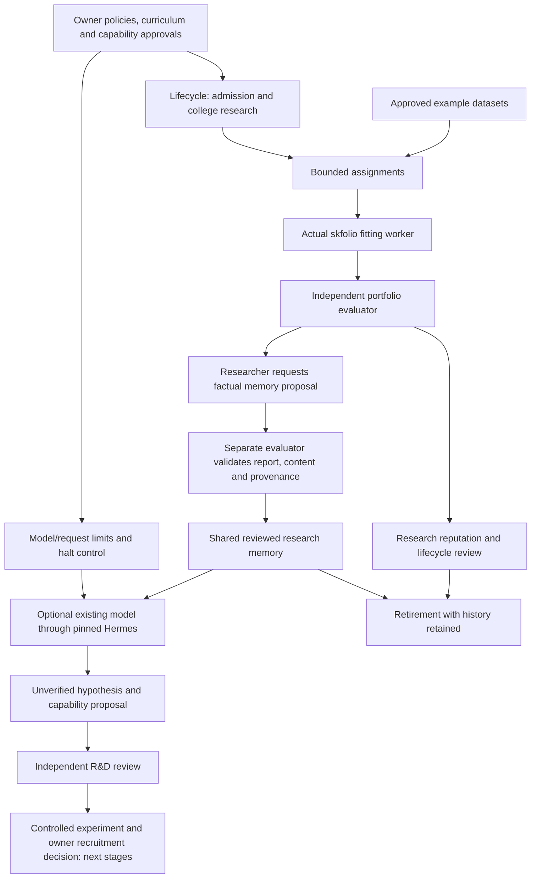

# Learning, existing models and organisation automation

> [Current implementation, validation and limits](current-status.md) is the current status index (v0.1.32). Dated milestones and design proposals retain their original scope.

Version 0.1.7 adds a factual experience-to-memory loop, versioned reflection profiles, a team supervisor and an optional Hermes R&D proposer. All new source is **unbuilt and unrun**. It implements another part of the owner's organisation; it does not claim complete autonomous growth or proven trading ability.

The owner clarified that we should reuse existing models and frameworks and customise the organisation around them, rather than spend time training a new foundation model. That is the approach here. The existing pinned Hermes `AIAgent` now has an additional structured research-capability task. Ruflo retains its existing bounded MCP task-mirror integration; it is not silently upgraded into the authority for every new feature.

## The connected workflow



Each bot has its own identity, specialty, method, curriculum, work history and reputation. They currently share role-specific worker processes; they do not each have an independently running language model or separately trained weights. A worker can serve many identities within the backend's assignment rules. Reviewed memory is shared while bot lineage remains attached.

## Factual memory versus a model's hypothesis

The deterministic `factual-reflection-v1` profile is a small **memory compiler**, not a language model. The owner registers its immutable manifest and hash. The researcher requests a cycle that converts an evaluated assigned portfolio trial into one factual reflection: which method was used, how many observations were evaluated, and whether the recorded relative diagnostic was above/equal/below the baseline. The wording explicitly limits the conclusion to one example test. It does not invent causes or predictions.

A separate evaluator identity checks the exact template, report hash, backend evaluation contract, current source evidence and model approval. The proposal is then independently marked verified or rejected. Proposal and review records are immutable. One trial can produce only one proposal across all policy/model versions. The default limits are twelve proposals per rolling day and one hundred lifetime; hard ceilings are one hundred/day and one thousand lifetime. Rejected proposals still consume the quota. There is no additional reputation or monetary reward for generating a memory.

The learning policy defaults off. Global halt or disabled learning policy stops proposal and review cycles. Retired bots' completed experiments can still contribute memory through the organisation's researcher/evaluator roles; the original identity and trial remain linked. Retirement does not wait indefinitely for optional reflection. Original archives remain snapshots, and memory history can be queried separately by bot ID.

Revoking supporting evidence, a source or the reflection profile removes affected items from reusable memory immediately on retrieval. Historical verification counts remain historical, not counts of currently valid knowledge. A changed reflection manifest requires a newly approved profile; changing a display name cannot bypass manifest uniqueness or per-trial deduplication.

Researcher memory reads require a target dataset. Only memories whose source holdout ends **before the target's training end** are returned; method and bot filters are also available. This prevents this memory API from exposing later-period feedback to an earlier experiment. It is not a complete defence against colluding identities, repeated adaptive research, externally obtained data or every historical information leak. Research protocols still need separate frozen validation periods.

The skfolio worker fetches this filtered context and reports its available count. Its fixed allocation algorithms do **not** consume prose or change themselves; output explicitly says `memoryUsedForFitting:false`. The new Hermes R&D task consumes the memory to propose future experiments. No learned strategy code or model weights are automatically deployed.

## Existing-model R&D through Hermes

The optional worker uses the existing isolated Hermes adapter and pinned source revision from [Hermes integration](hermes-integration.md). It receives at most ten currently verified, temporally filtered memories and a bounded list of existing capability declarations. No raw holdout prices, portfolio weights, financial credentials, database credentials, owner key or organisation API token enter the Hermes child. Text is treated as untrusted context; no tools are enabled.

The owner supplies the **existing served model name and endpoint** in an R&D policy. The endpoint can be a compatible local server or hosted service; this change does not select/download/train a new foundation model. `HERMES_MODEL`, `HERMES_MODEL_BASE_URL` and the reviewed source revision must match the backend-issued profile. The provider key stays in the local scoped configuration, not in the policy or database.

The backend authorises a three-minute request before inference, reserving one request against default limits of one per rolling day and ten lifetime. Hard ceilings are ten/day and one hundred lifetime. An expired/failed request still consumes its allowance. These are **authorised inference request counts**, not verified provider bills or exact API-call counts. Provider SDK retries and agent iterations can make more than one network call. Migration 022 adds immutable inference outcomes and an owner token ceiling; provider token counts remain optional worker claims. Monetary cost accounting is not implemented. See [model readiness](model-readiness.md).

Immediately before inference the worker rechecks backend authorisation, target source, memory support and halt state. A policy revision or pause invalidates outstanding requests. Local state records that inference started before calling Hermes. If a process crashes with an uncertain inference outcome, rerunning does not silently call the provider again. A completed proposal is saved before submission; reruns use the same content and receipt. There is still a narrow unavoidable gap between preflight and an already-started external call: a halt cannot retroactively cancel a provider request already in flight.

The model returns only `specialty`, the authorised `method`, `hypothesis`, `expectedContribution`, `risks` and supplied `memoryIds`. Backend validation, request ownership, context hash, source validity and memory membership govern acceptance. Output is stored as an **unverified hypothesis**, never as shared verified memory or executable instructions. A separate owner/evaluator can recommend or reject it. Recommendation is an accountable review decision, not proof of semantic novelty or profitability; it creates no bot, department, curriculum or financial permission. Automatic experimentation/recruitment from recommendations is a future step.

Hermes calls remain bounded by the existing adapter's process/agent timeouts, empty tool surface, sanitized environment and source verification. The upstream adapter and provider still require installation/configuration. No real inference has been performed in this workspace. Process isolation is not an OS sandbox; see the existing integration guide for deployment boundaries.

## Management and operating commands

Startup applies additive migrations 007 and 008. They create disabled policies and empty records; they do not start learning or inference. From the project folder, the owner can inspect:

```cmd
npm run lifecycle:admin -- learning
npm run lifecycle:admin -- development
npm run lifecycle:admin -- report
```

To configure factual memory deliberately, register `docs/examples/learning-model.json` using `lifecycle:admin -- model <file>`. Copy `docs/examples/learning-policy.json` to `.local/learning-policy.json`, match its revision/model ID, review the limits, and enable it explicitly with `lifecycle:admin -- learning-policy <file>`. This is separate from lifecycle and dispatch enablement. Enabling memory alone can process already completed assigned trials; creating new trials still needs the existing curriculum, blueprint and dataset approvals.

After configuration and a running backend, the new supervisor starts both research and evaluation loops from **one terminal**:

```cmd
npm run worker:organisation -- --minutes 30
```

It directly owns two Python children, gives each only its role credential, and stops both on Ctrl+C or when one role exhausts its retries. Sessions require an explicit 1–360-minute duration. Each cycle has a 110-second deadline. The researcher compiles factual proposals and fits assigned portfolios; the evaluator reviews portfolios and memories, then advances lifecycle and dispatch. Existing `worker:department` commands still work. The supervisor does not run Hermes/R&D, Ruflo, the original momentum worker, OS services or live execution automatically. It does not enable policies. It is a bounded local team session, not a distributed production process manager.

For optional Hermes R&D, follow its existing installation/environment instructions, then copy `docs/examples/development-policy.json` to a local file and set:

```json
{
  "expectedRevision": 0,
  "enabled": true,
  "model": {"name": "YOUR_EXISTING_SERVED_MODEL", "baseUrl": "http://127.0.0.1:8000/v1"},
  "maxPerDay": 1,
  "maxLifetime": 10
}
```

This is a placeholder, not a configured provider. Submit it using `lifecycle:admin -- development-policy <file>`. Explicitly start one request against an already registered target dataset with prior verified memory:

```cmd
npm run worker:development -- --dataset-id <UUID> --method equal_weight --request-key rd-session-0001
```

Reuse the same key and arguments after a lost response. Keep `integrations/hermes/.state/development` private and preserve it across restarts. Do not delete its records to make uncertain inference run again. If the log reports an uncertain provider outcome, inspect/reconcile the saved record before authorising any fresh attempt. A new request key consumes another backend allowance; it does not resume the old call.

Review drafts with `lifecycle:admin -- development`. An explicit `development-review <JSON file>` takes `{requestId,decision:"recommended"|"rejected",reason}`. To revoke a reflection profile use `revoke-model <file>` with `{modelId,reason}`. To inspect current reusable memory as owner use `memory <file>` with `{}` or filters. These CLI commands do not print secret tokens.

## API additions

All paths are under `/v1`. Mutations require an idempotency key; memory/preflight are read-only POSTs.

| Endpoint | Role | Purpose |
| --- | --- | --- |
| GET `/learning` | Owner/evaluator | Policy, model manifests, proposal/review history. |
| POST `/learning/models`, `/learning/model-revocations`, `/learning/policy` | Owner | Approve/version/revoke deterministic reflection and bound learning. |
| POST `/learning/cycles` | Researcher/evaluator | Propose or independently verify factual memories according to role. |
| POST `/learning/memory` | Owner/researcher/evaluator | Current reusable memories; researcher must give `datasetId`. |
| GET `/development` | Owner/evaluator | R&D policy, authorised requests, proposals and reviews. |
| POST `/development/policy` | Owner | Existing-model profile and inference-request budget. |
| POST `/development/requests`, `/development/proposals` | Researcher | Reserve context-bound inference and submit its unverified draft. |
| POST `/development/preflight` | Researcher | Recheck authorisation and provenance immediately before inference. |
| POST `/development/reviews` | Independent owner/evaluator | Recommend or reject a proposal; does not recruit. |

## Next stages and evidence

The subsequent v0.1.8 [registered experiment workflow](development-experiments.md) now provides fixed diagnostic plans and automatic aggregate review through the evaluator worker. Its diagnostic paths have later regression coverage and use existing methods only; new strategy specifications, experiment isolation and autonomous recruitment remain future stages.

Five backend regression cases and three Python R&D cases were added for role separation, immutable/deduplicated memories, temporal filtering, withdrawal, request quotas, independent review, no automatic recruitment, and no regeneration after uncertain outcomes. Later regression and isolated organisation checks cover these implemented paths; use the dated [verification record](verification.md) for exact runs. Direct model benchmarks do not qualify the production Hermes path.

Still to implement: controlled hypothesis experiments and novelty assessment, skill examinations, opportunity discovery, permissions for new departments, hackathons, the incident court, domain-specific fitness, real-world news/data ingestion, online monitoring, model comparison/selection, training or fine-tuning, governed code upgrades and production deployment. The organisation is designed for ongoing growth within evidence and resource limits; indefinite growth and successful handling of every situation cannot be promised.

<!-- documentation-navigation -->
[Documentation index](documentation-index.md) · Documentation reconciled for v0.1.32 on 7 October 2026; historical records retain their original scope.
