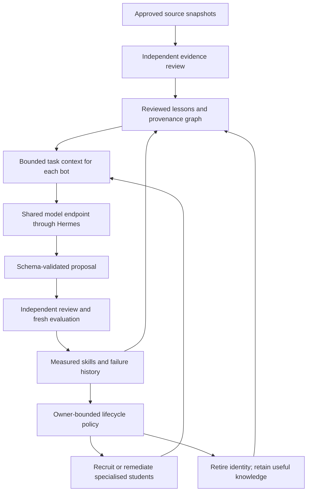

# Model strategy for the bot organisation

Updated 6 October 2026 for v0.1.32. This is a recommendation and evaluation plan, not an activation record.

## Decision

Use **one shared local Qwen3.5-4B Q4_K_M endpoint as the preferred experimental reasoning candidate**, behind the pinned Hermes adapter. Keep Qwen3.5-2B experimental, not an approved substitute. Both artifacts are present locally and pinned in [the lockfile](../config/local-model.lock.json); presence alone does not verify their hashes or qualify them. The example development policy remains disabled. No private configuration or running service was changed in this update.

The observed machine has an Intel i7-1355U and 15.69 GiB RAM. Only about 1.24 GiB was free at inspection; availability changes with other applications. Existing host documentation records integrated graphics and no CUDA. Four-bit weight files are about 2.74 GB (4B) and 1.28 GB (2B), **not total running memory**. Context cache, buffers, Python, PostgreSQL and the OS need additional memory. Free capacity before benchmarking; run one inference at a time. Do not start both models together on this host. Measure peak process memory and latency under the intended workload before accepting a model.

The [official 4B](https://huggingface.co/Qwen/Qwen3.5-4B) and [2B](https://huggingface.co/Qwen/Qwen3.5-2B) cards document the families and serving interfaces. [llama.cpp](https://github.com/ggml-org/llama.cpp) provides local quantised inference. Our GGUFs come from a separately pinned quantisation publisher, not directly from Qwen; retain provenance and verify hashes. Published general benchmarks cannot establish accuracy on our contracts or markets. Our existing 16k server context must fit the actual prompts; larger contexts also consume memory.

## What the local evidence says

The saved direct-engine report at `.local/model-benchmarks/20261006T170703Z/report.json` contains twelve calls to Qwen3.5-2B Q4_K_M:

| Task | Structurally valid outputs | Interpretation |
| --- | ---: | --- |
| Candidate selection | 2/2 | Contract compliance, not selection quality |
| R&D capability | 2/2 | A valid hypothesis is not a demonstrated capability |
| Knowledge plan | 2/2 | A valid plan does not prove learning |
| Article-to-lesson | 0/2 | Fails the current source-learning contract |
| Assessment | 3/4 | One malformed response; numerical skill is poor |

Assessment latencies in that report have a p50 of 72.6 seconds and maximum of 85.8 seconds. Offline regrading of the saved outputs with the corrected benchmark gives **one complete valid pair out of two planned**: 12.5% checks passed with lessons and 18.75% without. This is neither a learning gain nor market evidence. The historical report is preserved; its old paired-set count must not be reused. No model was called during regrading. Newer saved 4B reports are now available: free-form output failed three of four assessment contracts, while the constrained direct run passed all six tested output contracts (two lessons and four assessments). Its two complete pairs scored 17/32 with lessons versus 10/32 without; drawdown stayed 0/16. See the [selection evidence](model-selection.md). This makes constrained 4B the preferred experimental profile, not a production-qualified model.

## Separate the jobs

| Responsibility | Computation choice | Current position |
| --- | --- | --- |
| Read an approved article; propose a cited lesson or research hypothesis | Shared quantised language model through Hermes | Contracts and durable workers implemented; task quality not qualified |
| Give each bot a distinct identity | Bot ID, department, task, reviewed memories, lessons and outcomes in the database | Bounded context and graph implemented; no separate neural network per bot |
| Costs, P&L, drawdown, limits, permissions and wallet distribution | Deterministic backend/numerical code | Existing authority; never delegated to model judgement |
| Portfolio weights | Existing constrained skfolio worker | Research adapter, not proof of live returns |
| Learn numerical market patterns | Small statistical/tree baselines first; evaluate Kronos-mini/small separately | Future forecasting adapter |
| Tick processing and eventual arbitrage execution | Deterministic event-driven engine with risk checks | Future venue integration; no LLM in the latency-critical path |
| Recruitment, curriculum, review and retirement | Application policy plus measured results; AI can propose | Governed foundations exist; full adaptive organisation unfinished |

[Kronos](https://github.com/shiyu-coder/Kronos) lists mini (4.1M parameters) and small (24.7M) for candlestick forecasting. Its tokenizer and forecasting model form a separate numerical stack; it cannot replace the language model for reading articles. [FreqAI](https://www.freqtrade.io/en/stable/freqai/) informs adaptive prediction and model lifecycle experiments. Neither makes retraining profitable by default.

## Growth without multiplying model memory

This is the target architecture; the diagram does not claim a continuously operating autonomous loop exists. Current finite workers, graph and lifecycle records provide parts of it. A shared model receives separate contexts and permissions for each bot. Several bots repeating the same model output are correlated opinions, not independent corroboration.

Fitness must be role-specific: source bots earn credit for provenance and correction quality, risk bots for detecting violations, and research bots for reproducible held-out improvement after costs. Do not retire a risk bot for generating no direct revenue. Reward useful novelty, reliability and resource efficiency; penalise unsupported claims and repeated failures. Archive experience, citations and incident history before retirement; do not copy rejected claims into trusted knowledge. Department expansion needs a distinct opportunity, measured contribution and an owner-defined compute/population budget. These richer adaptive fitness and recruitment policies remain development work.

## Acceptance plan

1. Extend the existing 4B comparison to all five constrained contracts and fresh held-out cases, one process at a time. Keep revision, quantisation, runtime, prompts, sampler, memory and effective timeouts with each report.
2. Require all current contracts on fresh held-out cases, then adversarial source text, ambiguity, source withdrawal and expected abstention. JSON validity alone is insufficient. Set thresholds before seeing results.
3. Compare matching with/without-lesson cases. Inspect failures, coverage and latency even when valid-pair scores look good. Version 2 reports count all attempted assessment arms and expose incomplete coverage.
4. Implement and verify constrained output on the pinned Hermes path; the current schema option is direct-benchmark-only. Candidate tasks retain a 70-second process cap and capability tasks 150 seconds. Benchmark timeout overrides cannot remove production lease limits.
5. Enable only an accepted task-specific profile through owner policy. If 4B fails, keep those tasks disabled and improve bounded prompts/retrieval or evaluate another candidate. No silent fallback to a smaller or paid model.
6. Later, test chronological market datasets against simple baselines with fees, slippage, leakage controls, uncertainty and paper observation. Synthetic arithmetic is not trading qualification.

Accuracy, memory and speed trade off. There is no evidence for one model that maximises all three. Initial self-improvement means reviewed memory, better context and measured application, not continuous neural-weight changes. Fine-tuning is a later isolated experiment requiring curated training data, separate evaluation, version registration and rollback; bots cannot rewrite their authority.

## References and independence

The ten supplied repositories and their roles are mapped in [reference-map.md](reference-map.md). The visible conversation has ten distinct repository URLs, not fourteen; four additional repositories were not identified. This review used upstream READMEs/model cards and relevant local adapters, not a full audit of every source file.

Keep pinned source, lockfiles, compatible packages, model/tokenizer artifacts and licence notices locally with backups. Repository deletion does not remove retained files, but remote model/data APIs remain external dependencies. Our organisation owns its ledger, graph, policy and journals. An upstream framework must never become the authority for Wallet 2, withdrawals, profit ratios or bot permissions.

<!-- documentation-navigation -->
[Documentation index](documentation-index.md) · Documentation reconciled for v0.1.32 on 7 October 2026; historical records retain their original scope.
