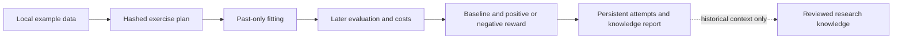

# Portfolio academy: repository-backed research

> [Current implementation, validation and limits](current-status.md) is the current status index (v0.1.32). Dated milestones and design proposals retain their original scope.

The offline academy introduced in version 0.1.2 calls **skfolio 1.4.11 itself** in an isolated Python environment. This fits portfolio allocations; it does not fine-tune a language model. It complements the backend's momentum research. Its local reports are not automatically submitted to NestJS or Ruflo and cannot confer graduation or trading access. Version 0.1.3 adds a separate [backend connection](portfolio-backend.md) with backend-calculated evaluation. Later isolated portfolio and organisation checks verified the backend workflow; see [verification](verification.md).

## Reference review and decisions

We reviewed relevant documented workflows and inspected skfolio's dataset loader and chronological splitter. This is a targeted review, not a full audit of ten repositories.

| Reference | Useful capability and current decision |
| --- | --- |
| [skfolio](https://github.com/skfolio/skfolio) | Actual `WalkForward`, `EqualWeighted`, `InverseVolatility`, and `MeanRisk` calls in this exercise. |
| [FreqAI](https://www.freqtrade.io/en/stable/freqai-running/) | Rolling historical retraining and evaluation inform our workflow. Freqtrade runtime and supervised training remain uninstalled. |
| [Qanat](https://github.com/fidetolabs/qanat) | Timestamped replay, costs and trial history inform our own journal. Qanat remains uninstalled. |
| [Kronos](https://github.com/shiyu-coder/Kronos) | Forecasting and tokenizer/predictor fine-tuning require weights, OHLC data and compute configuration. Later adapter; model choice remains open. |
| [Vibe-Trading](https://github.com/HKUDS/Vibe-Trading) | Reference for agent-assisted research and skills; not a supply of validated profitable strategies. |
| [NautilusTrader](https://github.com/nautechsystems/nautilus_trader), [Hummingbot](https://github.com/hummingbot/hummingbot) | Execution/venue candidates; not required to fit this portfolio example. |
| [Awesome Systematic Trading](https://github.com/wangzhe3224/awesome-systematic-trading) | Discovery catalogue, not a training dataset or learner. |
| [Hermes](https://github.com/NousResearch/hermes-agent), [Ruflo](https://github.com/ruvnet/ruflo) | Existing adapters retained. Hermes inference remains deferred; Ruflo's backend task mirror is verified. Neither runs in this offline exercise. |

## Data and evaluation

Use skfolio's bundled example of 20 selected S&P 500 constituents. The upstream [dataset loader](https://github.com/skfolio/skfolio/blob/main/src/skfolio/datasets/_base.py) describes this stale dataset as solely for examples/testing and unsuitable for investment, trading or commercial use. We use it only to test this integration. It is not current data, an unbiased historical universe, or evidence about Indian equities/DEX markets. Raw example prices are not included in our source ZIP.

The fixed exercise uses the last 2,521 price rows, yielding 2,520 returns. Each of 36 windows fits on the previous 252 returns and evaluates the following 63. Three predefined methods produce 108 trials. Past test periods can enter later training windows after they become historical. A method never fits on its own future test period. We do not select a winner from these same evaluation results.

Allocations are long only, sum to one, and have a 25% per-asset ceiling. Each window starts from cash, holds the initial quantities with drifting weights, and liquidates at the end. Entry and exit each cost an illustrative 15 basis points. Cash has zero assumed interest. This fractional, dimensionless experiment omits FX, tax, venue fills, liquidity and market impact. It is not INR wallet P&L.

The fixed diagnostic reward is:

`(netReturnBps - maxDrawdownBps) - (equalWeightNetReturnBps - equalWeightMaxDrawdownBps)`

Both positive and negative values are retained. This is a research score, not money or reinforcement-learning training. Equal weight has zero relative reward by definition. Other departments need different fitness criteria. No score changes authority, deletes an identity, promotes a bot, or allocates capital.

## Run and resume

The environment is installed in this workspace. From the project root:

```cmd
npm run academy:test
npm run academy:run
```

The launcher supplies one-thread numerical settings, a ten-minute deadline and a small environment without organisation/model credentials. The worker makes no network requests and spawns no subprocesses. These application controls are not an OS sandbox. Ctrl+C stops it. Rerunning resumes missing trials; a completed unchanged plan does no further fitting. Execution needs no model API or Codex credits, but the computer must remain on.

- `integrations/skfolio/.state/report.md`: readable status and feedback.
- `integrations/skfolio/.state/report.json`: weights, periods, metrics, baseline, hashes and failures.
- `integrations/skfolio/.state/academy.sqlite`: persisted successful, failed and interrupted attempts.

An OS lock prevents simultaneous runners. A database constraint prevents duplicate successful results. Interrupted attempts are recorded on restart. Two attempts per trial/plan are allowed; exhausted failures produce `needs_attention`. Partial runs report `paused`. Code, data, configuration or dependency changes create a distinct plan; old attempts remain. Reports are replaced atomically after each attempt. These files are the current notification surface, not the backend inbox. After a crash/deadline, the previous report may remain until restart.

## Reproduce and retain dependencies

The lock targets **Windows x64, Python 3.12** and pins twenty dependencies with selected wheel SHA-256 hashes. Other platforms require their own validated lock; do not bypass hashes.

```cmd
python -m venv integrations/skfolio/.venv
integrations/skfolio/.venv/Scripts/python.exe -m pip install --only-binary=:all: --require-hashes -r integrations/skfolio/requirements.lock
integrations/skfolio/.venv/Scripts/python.exe -m pip check
```

`dependencies.lock.json` records exact artifact URLs. The runner rejects version drift. Pinning does not establish absence of vulnerabilities. skfolio uses BSD-3-Clause; dependencies have their own licences. We call the library without copying its implementation. Preserve package licence files in any future binary distribution.

Installed runtime uses local code/data. Repository removal cannot erase local copies, but reinstalling needs retained artifacts or an available package host. To cache an offline reinstall:

```cmd
integrations/skfolio/.venv/Scripts/python.exe -m pip download --only-binary=:all: --require-hashes -r integrations/skfolio/requirements.lock -d .local/skfolio-wheels
```

The worker stops after finishing its exercise. Continued useful learning requires new approved data or a new exercise. Next steps are a permitted market-data source, point-in-time ingestion and broader held-out evaluation. Language-model qualification and Kronos forecasting remain separate tracks; see [model strategy](model-strategy.md).



<!-- documentation-navigation -->
[Documentation index](documentation-index.md) · Documentation reconciled for v0.1.32 on 6 October 2026; historical records retain their original scope.
