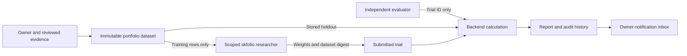

# Portfolio research backend connection

> [Current implementation, validation and limits](current-status.md) is the current status index (v0.1.32). Dated milestones and design proposals retain their original scope.

Version 0.1.3 introduced the Python-to-NestJS connection. Later isolated HTTP and organisation checks exercised portfolio fitting and independent evaluation; see the dated [verification record](verification.md). These checks do not establish live-market performance or persistent deployment. Development commands may be run through Command Prompt; Docker verification remains deferred.

## Start from the existing workspace

Dependencies and development credentials already exist here. From PowerShell:

```cmd
cd /d "C:\Users\KeerthanMuniRajaT\Documents\Codex\2026-10-03\i-x20\Nexus"
npm run build && npm start
```

Build compiles TypeScript; it does not run tests. Startup applies migration `004_portfolio_research.sql` to the configured local paper database, then listens on the existing configured address. Stop with Ctrl+C. Startup does not seed datasets, launch workers, fit models, or place orders. There is no new dependency install for this increment. A new checkout still needs the setup steps in the README and the isolated Python environment in [portfolio academy](portfolio-academy.md).

## Responsibilities and data flow

1. Owner registers a portfolio dataset linked to independently verified dataset evidence from an approved source.
2. Researcher requests only training observations and a fixed policy, fits one of three allocation methods, and submits weights.
3. A separate evaluator requests review using the trial ID. It supplies no performance metrics.
4. NestJS calculates the result from its stored holdout, including the equal-weight baseline, entry/exit costs, drawdown and diagnostic reward.
5. The backend stores the review, appends an audit event, and places a notification in the owner's existing inbox.



These routes form a separate portfolio workflow. Existing momentum jobs, Hermes and Ruflo retain their current contracts. Portfolio trials are not yet on Ruflo's task feed and are not consumed by the existing momentum worker. The offline academy SQLite journal is not blindly imported as verified performance: the backend connection fits against a registered training dataset and calculates its own evaluation.

## API contract

All paths below start with `/v1/portfolio`. Normal role authentication applies. Mutations require the existing `Idempotency-Key`; `/training` is a read operation using POST and does not require it.

| Method/path | Role | Body or response |
| --- | --- | --- |
| POST `/datasets` | Owner | `{evidenceId,purpose,assets,training,holdout}`; returns `{id,digest,purpose}`. |
| POST `/training` | Researcher | `{datasetId}`; returns training, canonical asset order, dataset digest and fixed policy. No holdout or evaluation results. |
| POST `/trials` | Researcher | `{botId,datasetId,datasetDigest,method,weights}`; returns the trial ID. Bot must be in college. |
| POST `/reviews` | Evaluator | `{trialId}` only; calculates and stores the report. Authors cannot evaluate their own submission, even using a different role with the same identity. |
| GET `/trials` | Owner, evaluator | Latest 100 trials with reports and current evidence validity. |
| POST `/cancellations` | Owner | `{trialId,reason}`; closes a pending trial while preserving its history. |

The only accepted purpose is `example-testing`. This intentionally does not expose a real-data qualification path until market/provider provenance and eligibility requirements are implemented. Dataset registration accepts 4–20 unique asset symbols, 60–504 training rows and 20–126 holdout rows. Each row is `{timestamp,returns}`; returns are dimensionless simple returns in exactly the asset order, greater than -1 and at most 1. Missing values, unknown fields, mismatched dimensions, future dates, or overlapping training/holdout periods are rejected. Timestamps are normalised to UTC, and asset columns are sorted before calculating hashes. The API's existing 512 KB body limit also applies.

Weights must be nonnegative, sum to one within numerical tolerance and stay at or below 25% per asset (solver tolerance `1e-7`). Backend normalisation is followed by another cap check. Supported method names are `equal_weight`, `inverse_volatility`, and `minimum_variance`. A method label records the submitter's declared method; it is not cryptographic proof of which software produced the weights.

The score reproduces the offline lab's fractional buy-and-hold calculation: drifting quantities, 15 basis points for entry and exit, cash baseline interest zero, and reward relative to equal weight. It is a research number, not ledger money. The report always includes `promotionAllowed:false`. Example results do not change the bot's academy state, wallet balances, permissions or spending limits.

## Recovery, lifecycle and boundaries

- Replaying an identical idempotency key/body returns the prior response. The worker saves its exact proposal before sending it, so a lost response does not trigger a new fit on retry.
- One submission per bot, method and exact holdout digest prevents repeated proposals for that same assessment, including after changing the training window. Reordering columns or changing evidence IDs does not make identical observations a new assessment. Slightly changed or overlapping datasets are not detected as equivalent; dataset governance and broader anti-overfitting controls remain needed.
- A revoked source or evidence blocks training reads and submissions and marks pending dependent trials revoked. Completed reports remain historical records with `evidence_active:false`.
- Retirement requires pending portfolio work to be reviewed, cancelled or revoked. Cancellation never erases the proposal or frees its holdout for another attempt.
- Worker tokens are scoped by role. The launcher does not pass owner credentials to the Python child. The worker runs once, with one-thread numerical settings and a two-minute deadline; this is not an unattended scheduler or an OS sandbox.
- Backend roles separate service access, but processes sharing a machine and public example data do not provide physically secret holdout storage. A production research sandbox and genuinely unseen governed data remain future work.

## Running a registered trial

After registering a dataset and preparing a college bot, use their actual IDs in a second terminal:

```cmd
npm run worker:portfolio -- researcher --bot-id YOUR_BOT_ID --dataset-id YOUR_DATASET_UUID --method minimum_variance
npm run worker:portfolio -- evaluator --trial-id RETURNED_TRIAL_UUID
```

Each launch selects only that role's credential from the existing development `.env`. Use the same arguments after an uncertain result. Proposal intents are in `integrations/skfolio/.state/bridge`. Inspect reports through authenticated `GET /v1/portfolio/trials` and notifications through `GET /v1/operations`. No new public route exposes holdout data or detailed trial metrics.

## Optional verification, for the owner to run later

The saved command is available when testing resumes:

```cmd
npm run verify:portfolio
```

It compiles, runs the backend suite, runs the Python academy/bridge tests, and exercises all three actual skfolio methods against a fresh in-memory HTTP backend. The integration check uses ephemeral credentials, a zero-budget bot, and the bundled example dataset. It compares backend metrics with Python reference metrics, checks replay and permissions, and checks the empty ledger. It does not load the owner's `.env` or persistent paper database. The example periods have already been used locally and are not pristine research holdouts.

The command stops at the first failure and writes `.local/portfolio-verification.json` plus stage logs under `.local/portfolio-verification/`. The HTTP check also writes `integrations/skfolio/.state/last-http-check.json`. A report claiming success exists only after the command actually passes; no results have been prefilled for this version.

Market-data collection remains pending the owner's initial market choice and an approved provider. No provider, account, data subscription, or model was selected by this increment.

<!-- documentation-navigation -->
[Documentation index](documentation-index.md) · Documentation reconciled for v0.1.32 on 6 October 2026; historical records retain their original scope.
