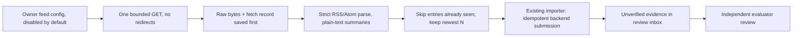

# Publisher feed intake — v0.1.32

The first generic **approved-publisher adapter** (DATA-01 in the [remaining-work assessment](remaining-work-assessment.md)). It reads one owner-configured RSS 2.0 or Atom 1.0 feed, keeps a durable checkpoint, and submits new entries through the existing [source-observation intake](source-observations.md). Every submitted entry is **unverified evidence**: an independent evaluator must still review it, and lessons still need their own review.

No publisher has been selected or contacted. The example configuration is disabled. Choosing a feed, and confirming that its terms allow this use, is an owner decision.

## What it does



- **Network:** each invocation makes at most one GET to the configured `feedUrl`, plus backend submission. Redirects are refused (`FEED_REDIRECT_REFUSED`), so no other destination is contacted. HTTPS is required. Backend credentials are never sent to the publisher.
- **Bounds:** responses are capped at 1 MiB, timeouts are 1–30 seconds, and `Content-Type` must be RSS, Atom or XML. Parsing reads at most 100 entries, 20,000 elements and 32 levels of nesting.
- **Untrusted text:** DTD and entity declarations are refused outright, so external-entity and entity-expansion attacks cannot work. Only UTF-8 is accepted. Publisher HTML is reduced to plain text and labelled `Feed summary (not the full article)`. Summaries are truncated to the backend's 4,000-character limit. Full article bodies are not fetched.
- **Times:** RSS (RFC 822) and Atom (RFC 3339) dates must carry an explicit zone (`GMT`, `Z` or a numeric offset). Unzoned or named local zones such as `EST` are rejected rather than guessed. Entries dated after retrieval are rejected.
- **Origins:** every entry link must map to an owner-supplied `origin → sourceId` entry. The backend also requires that origin to match the approved source. Relative links resolve against the feed URL, so the feed host needs its own mapping if it is used.
- **Invalid entries** are skipped and recorded with fixed reasons, without echoing publisher text or URLs. Valid entries from the same feed are still submitted. This differs from the Vibe batch, which blocks on any rejected row.

## Checkpoint, politeness and recovery

Each feed uses its own state directory: `manifest.json`, `checkpoint.json`, `feed.lock` and `runs/<run-id>/`. The manifest binds the directory to the exact configuration, backend origin and a hash of the researcher credential. If any of those change, the old state is refused, so use a new directory.

| Situation | Behaviour |
| --- | --- |
| Before `pollIntervalMinutes` (15–1440) has passed since the last attempt | Returns `not-due`; no request is sent. |
| Unchanged feed | `ETag` / `Last-Modified` are sent; a `304` returns `not-modified`. |
| Fetch failure | Codes such as `FEED_UNREACHABLE`, `FEED_TIMEOUT` or `FEED_HTTP_ERROR`. Backoff is the poll interval × 2^(failures−1), capped at 24 hours; `Retry-After` on 429/503 is honoured. |
| Unparseable feed | `parse-failed`. The bytes are kept for inspection; validators do not advance; backoff applies. |
| Entry already submitted | Skipped locally, using the importer's own idempotency key. The last 2,000 keys are kept. Backend deduplication still applies. |
| Corrected entry (same link, changed text) | Submitted as a new unverified revision. The earlier revision is kept and is **not** revoked automatically. |
| More new entries than `maxItemsPerCycle` (1–50) | The newest N are submitted oldest-first. `skippedOverCapacity` reports the rest. Backfill is not supported. |
| Crash before bytes were saved | The next run records `interrupted-fetch-discarded`. Nothing was submitted, and a fresh fetch follows. |
| Lost acknowledgement or backend outage | The run stays active. A rerun submits the **saved** selection with identical keys and does not refetch. |
| Crash after the outcome was saved | The rerun applies the saved outcome once; it does not submit again. New fetch-failure outcomes include the absolute retry deadline; recovery restores backoff and counts. Recovered 304 outcomes clear previous failures. |
| Source withdrawn, system halted or source quota reached | Submission is not acknowledged and the run stays active. Fix the cause and rerun, or abandon the run explicitly after inspection. |

Withdrawn or deleted feed entries do nothing locally; evidence revocation remains an explicit backend action. Journals are trusted local operator state, not tamper-proof evidence. There is no automatic stale-lock takeover: confirm the worker has stopped before removing `feed.lock`.

## Commands

Register and approve the publisher with the existing `POST /v1/sources` route first. Then copy `config/publisher-feed.example.json` to a local file, set `enabled: true`, the real `feedUrl` and the approved `sourceId`, and review the limits. The `.env` file must hold exactly one researcher credential.

```cmd
npm.cmd run sources:feed -- run .local\feed-publisher.json .local\feeds\publisher
npm.cmd run sources:feed -- run .local\feed-publisher.json .local\feeds\publisher --minutes 120
npm.cmd run sources:feed -- status .local\feeds\publisher
npm.cmd run sources:feed -- abandon .local\feeds\publisher --reason "Source withdrawn; run inspected"
npm.cmd run review:news
```

- **`run`** performs one cycle and exits. It exits nonzero on `fetch-failed` or `parse-failed`.
- **`--minutes`** runs a finite session (1–360 minutes). It waits for each next due time, stops after three consecutive cycle errors, and stops on Ctrl+C. It is not an OS service and does not restart after shutdown.
- **`status`** reads only the local checkpoint.
- **`abandon`** closes the unfinished run without marking its entries as seen, so a later fetch can offer them again.
- **`review:news`** lists the resulting evidence for an evaluator.

## Validation

- `npm.cmd run test:feeds` runs 21 tests:
  - Parser: RSS/Atom extraction, refusal of DTDs and entities, malformed XML, fixed rejection reasons, length bounds, strict dates.
  - Client: configuration bounds, conditional requests, redirect/error/type/size codes, Retry-After, real loopback HTTP for redirect refusal and timeout.
  - Cycle: politeness, ETag, lost-acknowledgement resume, corrections, capacity, backoff, parse failure, crash recovery (including failed fetch and 304), abandon, binding, lock, finite session.
- `npm.cmd run verify:feeds` builds the backend and runs a real in-memory backend with a loopback synthetic publisher. It checks:
  - Lost-acknowledgement recovery without duplicates.
  - The poll interval and ETag.
  - A correction stored as a new revision.
  - The review requirement.
  - Source withdrawal followed by abandonment.
  - No credentials sent to the publisher, no financial writes, and a valid audit chain.

  Report: `.local/feed-verification.json`.

These checks use synthetic feeds. They do not show that a real publisher's feed parses, that its terms allow collection, or that collected claims are true.

## Not done

- Publisher-specific parsing and full-article retrieval.
- Corroboration across independent sources.
- Claim/entity extraction (DATA-02).
- Organisation-wide scheduling and inclusion in the supervisor heartbeat or owner report.
- Distributed leases.
- Alerting for repeated feed failures.

<!-- documentation-navigation -->
[Documentation index](documentation-index.md) · Documentation reconciled for v0.1.32 on 6 October 2026; historical records retain their original scope.
