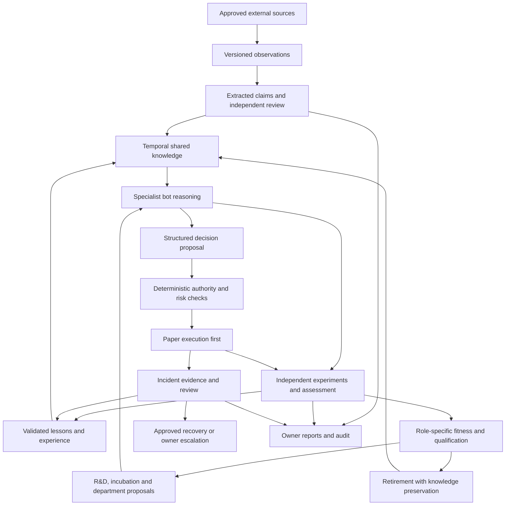

# Remaining work to build the self-growing trading organisation

**Assessment date:** 6 October 2026  
**Original codebase snapshot:** v0.1.25, migrations 001–019; updates through v0.1.32 / migration 022 follow.
**Purpose:** turn the owner's original vision into an implementation-backed completion plan.

**Development update, v0.1.32:** Corrected benchmark pairing and coverage, effective Hermes timeouts and feed failure/304 recovery. Local model artifacts and a direct 2B report now exist, superseding older no-inference statements. The 2B run failed source-learning and numerical tasks; Newer direct constrained 4B results pass the tested schemas but still fail drawdown. Constrained 4B is the preferred experimental profile; production Hermes remains unqualified. See [selection evidence](model-selection.md). AI-01 stays open for production Hermes/task qualification. Read [model strategy](model-strategy.md) for shared inference, memory constraints and role-specific growth. No autonomous retraining, release, live funds or new departments were activated.

**Development update, v0.1.30:** Per-request inference reports and an owner token ceiling (migration 022) cover AI-01's usage-recording and spend-ceiling evidence at token level, and gap 12's request-kind reporting. Production token counts, monetary budgets and a real endpoint remain open.

**Development update, v0.1.29:** [Model readiness](model-readiness.md) adds AI-01 pre-activation tooling: versioned prompt contracts, an endpoint doctor and a budgeted task benchmark that records validity, latency, tokens and a paired with/without-lessons assessment comparison. AI-01 remains open until a real endpoint completes these contracts and usage is recorded per backend request.

**Development update, v0.1.28:** [Publisher feed intake](publisher-feeds.md) implements DATA-01's generic adapter: bounded fetch, checkpoint/cursor, backoff, size/time limits, refused redirects, replay-safe resubmission, corrections as new revisions and source-withdrawal handling, verified against a synthetic loopback publisher and real in-memory backend. DATA-01 stays partial until an owner-selected publisher and its access terms are exercised on a real feed.

**Development update, v0.1.27:** [Bounded learning workflows](learning-workflows.md) now connect source proposals, transfer, assessment issuance/answers/grading with owner-selected participants and durable links. AUTO-01 remains partial: review judgement, discovery, recipient selection, distributed leases and persistent organisation-wide scheduling remain outstanding. The v0.1.25 inventory below is historical.

**Development update, v0.1.26:** [Source learning](source-learning.md) now implements a bounded article-to-lesson proposal and dedicated review path with exact quotation checks. DATA-02 remains partial: corroboration, claim/entity modelling, real inference validation and orchestration are still pending. The inventory and findings below remain the dated v0.1.25 review snapshot.

## 1. Where we actually stand

We have a working, governed **paper research organisation foundation**. It can register bots, run limited research, evaluate results, record lessons and experience, share reviewed knowledge, manage an example student lifecycle, preserve retired bots' history, and enforce simulated treasury rules.

We do **not** yet have a continuously operating AI organisation that discovers new opportunities, learns demonstrably useful skills, creates differentiated teams, improves its own deployed capabilities, and earns verified trading revenue. Those are the central remaining objectives—not merely a final model connection or a frontend.

The existing work should be extended, not discarded. Its strongest parts are the application-owned authority, durable records, independent grading, permission checks, replay protection and paper capital accounting. The largest missing parts are real inference, continuous knowledge acquisition, measured improvement, an organisation-wide workflow, and market-connected decision/execution.

“Self-growing” should mean improving and expanding within owner-defined resources and permissions. No finite system can promise unlimited growth, perfect decisions, guaranteed profit or automatic recovery from every possible failure. An unresolved case must be able to stop safely, preserve evidence and notify the owner.

### Review scope and evidence

This assessment inventories **162 first-party source/configuration/test files, 12,417 lines**, including 33 backend source files and 19 migrations. It traces the main request, worker, learning, lifecycle, financial and integration paths and compares them with the original knowledge-base requirements. The [inventory appendix](codebase-review-inventory.md) lists the files and a snapshot fingerprint.

This is an architectural and implementation gap assessment, not a claim of a line-by-line security certification. Third-party source trees, installed packages, generated output, private configuration, credentials and live database contents were excluded. Running policies or provider availability were not inferred from the source. No model, Docker engine, bank, exchange or persistent worker was activated for this review.

Existing validation evidence was inspected rather than rerunning unchanged software: the v0.1.25 log records **101 backend tests passed**, the importer has **2 passing tests**, and the Python-to-HTTP knowledge fixture passed using a deterministic stand-in. Earlier Hermes unit tests use mocked inference. Ruflo has a recorded real MCP integration pass on the owner's normal Windows host; Docker isolation testing remains explicitly deferred. See [verification](verification.md) and [Ruflo result](ruflo-live-result.json). Passing these checks does not establish learned intelligence, trading profitability or production readiness.

Some older guides retain historical status language: for example, the reference map's early skfolio connection status predates later workflow validation, and some model-selection wording predates the provisional candidate. Use source, dated verification records and this assessment together. Consolidating those historical/current distinctions is documentation maintenance, not a missing runtime feature.

## 2. Your vision mapped to the code

Status meanings: **working foundation** = implemented within its stated scope; **partial** = substantial pieces exist but the desired outcome is incomplete; **missing** = no complete implementation found; **unverified** = implementation/candidate exists without the required runtime evidence.

| Desired capability | Current implementation and evidence | Remaining gap |
| --- | --- | --- |
| Each bot has a distinct brain and role | **Partial.** Bot identities, roles, curricula and context exist in [organisation](../backend/src/organisation.ts) and [bot knowledge](../backend/src/bot-knowledge.ts). | Per-bot versioned runtime identity, persistent specialist memory, tool grants and model/prompt selection; prove differentiated behaviour. A database bot record is not a separately trained model. |
| Real AI reasoning | **Partial/unverified.** [Hermes](../integrations/hermes/adapter.py) calls a pinned runtime through strict, tool-disabled contracts. Qwen3.5-9B is a provisional configuration. | Validate a real serving endpoint, hardware fit, latency, quality, reliability and cost; run the organisation's actual tasks. |
| Gather knowledge from news and the internet | **Partial.** [Source observations](../backend/src/source-observations.ts) retain immutable collector-submitted snapshots; a [batch importer](../scripts/import-observations.mjs) exists. | Automatic approved-source retrieval, parsing, freshness, source authentication checks, corroboration and extraction into useful claims/lessons. |
| Understand large traders and the surrounding environment | **Missing.** Generic evidence records can hold observations. | Public disclosure/on-chain adapters, entity and instrument mapping, delayed-data handling, macro/fundamental/narrative specialists. Observed activity must be separated from guessed motives. |
| Shared knowledge graph | **Partial.** SQL-derived graph connects bots, lessons, evidence, sources, transfers, assessments and experience. | Market entities/events, temporal claims, contradictions, source dependence, semantic retrieval and selective knowledge routing. A separate graph database is not a prerequisite. |
| Learn from experience | **Partial.** [Factual reflection](../backend/src/learning-contract.ts) produces reviewed templated memories; accepted plans and assessment results enter later context. | Show that experience changes behaviour and improves fresh-task results. No weight-training pipeline or proven causal learning effect exists. |
| School and college | **Working foundation, narrow.** [Academy](../backend/src/skills.ts) has synthetic exams, grading, failure diagnosis and controlled recovery. | Role-specific curricula, model-backed assessment, persistent skill profiles, qualification expiry and ongoing requalification. |
| Positive/negative rewards and survival of the fittest | **Partial.** [Lifecycle](../backend/src/lifecycle.ts) updates reputation and retirement from disjoint example-portfolio windows. | Role-specific contribution, reliability and cost measures; avoid rewarding only direct trading revenue or removing valuable risk specialists. |
| Birth, graduation and retirement | **Partial.** Approved blueprints can create zero-budget research students; curriculum/exam gates and archival retirement exist. | Opportunity-driven proposals, novelty validation, complete graduation into qualified work, suspension/reserve/re-entry and all-workflow retirement draining. |
| No wasteful duplicate bots | **Partial.** Identity and specialty/method keys reject exact declared duplicates. | Behavioural/output overlap, marginal contribution and capacity evidence; separate work partitions for justified replicas. |
| Hackathons and autonomous R&D | **Partial R&D; missing hackathon system.** [Development experiments](../backend/src/development-experiments.ts) register fixed experiments; [paired skills](../backend/src/skill-experiments.ts) compare versions. | Challenges, team registration, sealed evaluation, cost budgets, judging, knowledge extraction, incubation and recurring scheduling. |
| New departments and revenue-linked expansion | **Missing.** Department labels, bounded worker roles and example quotas exist. | Department charters, membership/leadership, budgets, opportunity evidence, qualified capabilities and expansion/closure workflows. |
| Bot court and institutional accountability | **Partial precursor.** [Operations](../backend/src/operations.ts) records incidents and halts; [diagnostics](../backend/src/skill-diagnostics.ts) records observed failed checks. | Case files, causal investigation, independent review, decisions, remedies, appeals and organisation-wide corrective lessons. |
| Automatic recovery | **Partial.** Lease recovery, durable submissions, artifact journals and cleanup tracking exist. | Broader diagnosis and approved runbooks, service restart recovery, containment verification and escalation beyond retrying work. |
| Team coordination | **Working foundation, narrow.** [Ruflo mirror](../integrations/ruflo/mirror.mjs) maps application-owned research tasks to MCP; department supervisors run bounded cycles. | One coherent workflow spanning sources, reasoning, review, assessment, R&D, lifecycle and reports. |
| Trading intelligence and portfolio decisions | **Partial research only.** Momentum selection and three portfolio methods exist in [research](../backend/src/research.ts), [portfolio](../backend/src/portfolio.ts) and [skfolio lab](../integrations/skfolio/lab.py). | Real data, broader validated strategies, uncertainty, abstention, portfolio constraints and a reviewed signal-to-order path. |
| Fast DEX arbitrage | **Missing.** No scanner, route simulator, chain transaction executor or venue connector found. | A separate chain-specific execution track; it is not equivalent to stock/news trading and should not depend on an LLM in the latency-critical path. |
| Wallet rules | **Working paper foundation.** [Treasury](../backend/src/treasury.ts) implements principal accounting, available-capital reservations, cumulative eligible profit and fixed 60/40 distribution. | Real custody/accounts, settlement reconciliation and durable external transfers. SBI and both wallets are currently simulated ledger concepts. |
| Owner-only control and updates | **Partial.** Scoped credentials, signed financial requests, reports, inbox notifications and audit history exist. | Secure operator experience, alert delivery, cost/learning reports, runtime credential management and operational deployment. |
| Independence from upstream repositories | **Partial.** Dependency/source pins and local adapters exist. | Reproducible installation, retained licensed artifacts/weights, recovery copies, provider substitution and maintenance. Local copies do not remove hosted-service dependencies. |

## 3. Concrete implementation gaps that affect the next build

These are source-backed limitations or review concerns. They are not claims that every item is an exploitable defect, and they were not changed during this documentation task.

1. **The main department loop does not run the new knowledge pipeline.** [department.py](../integrations/skfolio/department.py) runs exams, portfolio dispatch, factual reflection, diagnostics and lifecycle cycles. It does not schedule source observations, Hermes knowledge requests, transfer review, fresh assessments or opportunity generation. Those are separate endpoints/commands. Merely leaving the organisation launcher running will not produce the intended external-learning loop.
2. **Reading memory does not currently modify portfolio fitting.** The same department worker explicitly reports `memoryUsedForFitting: False`; [bridge.py](../integrations/skfolio/bridge.py) fits one of three fixed methods. A memory count is not evidence that a bot applied a lesson.
3. **The academy mostly measures the shared solver.** [skills.py](../integrations/skfolio/skills.py) calculates answers deterministically. Passing shows that adapter can answer the research-basics contract, not that each student's model learned its curriculum. [knowledge-assessments.ts](../backend/src/knowledge-assessments.ts) adds four fresh cases, but explicitly has no before/after control or verified model execution claim.
4. **The optional skill gate can be disabled.** `schoolSkillReady()` in [skills.ts](../backend/src/skills.ts) returns true when skill policy is disabled. This supports the existing example workflow. A later production qualification policy must distinguish “exam disabled” from “qualified”; do not silently carry this shortcut into real authority.
5. **Automatic novelty is currently a declared label check.** [lifecycle.ts](../backend/src/lifecycle.ts) compares department/specialty/method keys and accepts owner-approved blueprints. New wording does not prove a new skill, and repeated profitable examples do not justify a new department.
6. **Two research paths have different evaluation guarantees.** The portfolio path computes results in the backend; the older momentum path in [research.ts](../backend/src/research.ts) validates an independent evaluator's submitted numerical report and may qualify a bot for paper trading. It does not independently recalculate every reported metric. Harmonise those guarantees before broadening qualification.
7. **Timestamps are not yet a complete historical knowledge filter.** Observation time now exists, but current knowledge retrieval is not an as-of market replay API. [sharedResearchMemory](../backend/src/learning-contract.ts) filters a trial's holdout end for some requests; it does not establish that the later review/memory itself existed before a simulated decision. Future backtests need publication, ingestion, review and effective-time cutoffs together.
8. **Retirement accounting needs every newer workflow.** [hasOpenBotWork](../backend/src/lifecycle-history.ts) covers orders, positions, portfolio trials, dispatch assignments and legacy jobs. It does not enumerate pending knowledge transfers/assessments or every R&D workflow. Define cancellation/draining for them before treating retirement as complete organisational shutdown.
9. **Research approvals are records, not release controls.** [research-approvals.ts](../backend/src/research-approvals.ts) explicitly says no worker consumes the approval as execution authority. Approval/revocation does not deploy, stop or roll back code. A separate release consumer and runtime policy are needed.
10. **Logical bot identity and worker credentials are different today.** Researcher/evaluator principals are service roles; trader credentials are explicitly bot-bound in [config.ts](../backend/src/config.ts). Define task-scoped authority for multiple specialist runtimes before giving every bot a long-lived credential or assuming service identities prove independent thinking.
11. **The storage/limits are deliberately small.** [database.ts](../backend/src/database.ts) normally serialises transactions on the global system lock; many reads return the newest 50–100 records. Several registries have lifetime caps. This is appropriate for a bounded prototype, but long-running growth needs pagination, archival policy, migrations and measured concurrency improvements—not removal of all limits.
12. **Current reports do not explain the full new learning pipeline.** [organisation-report.ts](../backend/src/organisation-report.ts) focuses on managed students, dispatch, factual memory and development counts. Add source freshness, transfer/assessment queues, model costs, validated skill changes and institutional decisions. Shared `development_requests` rows also need explicit request-kind reporting so portfolio R&D, knowledge and assessment tickets are not conflated.

## 4. Prioritised work packages

Priority **P0** establishes a functioning learning organisation; **P1** adds institutional growth and reliable paper decisions; **P2** supports production/live operation after qualification. Priorities describe dependency order, not permission to enable money or external services automatically. “Done” requires the acceptance evidence below, not just an endpoint or passing mock.

### P0 — actual brains and a complete learning cycle

| ID | Work to implement | Completion evidence | Main dependency |
| --- | --- | --- | --- |
| AI-01 | Connect and benchmark a real existing model through Hermes. Record model revision, prompt version, settings, provider/runtime and usage. Add health checks, bounded timeouts, cancellation and spend ceilings. | Real inference completes our transfer and fresh-task contracts; malformed output, provider outage and timeout fail safely; actual latency/token/cost records are inspectable. | Model endpoint and resource budget; no custom model training required first. |
| AI-02 | Versioned bot runtime profiles: role, model/prompt, skills, memory scope, tool permissions and task-specific identity. Reuse a base model with distinct context/configuration before considering separate weights. | Two specialists use different authorised context and assignments, retain their histories and cannot impersonate each other or acquire privileges through model output. | AI-01; existing bot/producer registries. |
| DATA-01 | One approved publisher adapter with a bounded fetch cycle, cursor/checkpoint, backoff, size/time limits and safe redirect/network handling. Retain retrieval metadata and connect to observation intake. | Actual permitted feed/article ingestion survives restart and replay, handles corrections and source withdrawal, and produces no duplicates or hidden network destinations. | Existing source registry/observations; owner-selected source and access terms. |
| DATA-02 | Source-to-claim and claim-to-lesson extraction. Capture exact supporting spans, dates, entities, uncertainty, contradictions and source dependence; separate extraction from verification. | A model-generated claim cannot enter verified knowledge without a traceable supporting snapshot and separate review; malicious article instructions do not become commands. | AI-01, DATA-01. |
| KG-01 | Extend the current SQL knowledge model with instrument/company/person/event/claim relationships, correction/supersession links and as-of validity. Add relevance retrieval and memory budgets. | A decision can reconstruct exactly what was known and reviewed at its cutoff; stale/revoked/contradicted claims are excluded or explicitly qualified; unrelated bot memory is not indiscriminately copied. | DATA-02; existing graph. |
| LEARN-01 | Demonstrate transfer benefit using registered matched tasks, a baseline without transferred context, repeated trials and held-out task families. Keep errors and negative results. | Evaluation reports distinguish raw success from incremental benefit, include regressions and resource cost, and reproduce under recorded model/prompt versions. | AI-01/02, KG-01; existing assessments/paired framework. |
| AUTO-01 | Add durable orchestration for intake → review → lesson → recipient selection → transfer → assessment → feedback. Use independent role workers, durable workflow state, explicit waits and bounded concurrency. | A finite unattended run completes the whole chain with actual inference; crash/restart does not regenerate uncertain work, repeat rewards or bypass pending reviews. | DATA-01/02, AI-01, current journal/lease patterns. |
| OBS-01 | Extend owner reporting with current stage, blockers, evidence links, learning changes, inference cost, source health and failed/recovered work. Add an explicitly configured delivery channel. | Owner receives a useful summary and actionable failure notification; retries do not spam or falsely report recovery. | AUTO-01; current audit/inbox/report APIs. |

The first demonstrable milestone is this complete **bounded, money-free learning cycle**. Automatic weight updates are not necessary to reach it. Retrieval, improved prompts and versioned skills can be evaluated first; fine-tuning is a later option if measured evidence justifies it.

### P1 — an institution that develops and selects capabilities

| ID | Work to implement | Completion evidence | Main dependency |
| --- | --- | --- | --- |
| SCHOOL-01 | Role-specific curricula, prerequisite graphs, separate practice/exam sets, model-backed examinations, expiring qualifications and retests on relevant change. Remove optional-gate ambiguity for qualified work. | A bot must demonstrate its own versioned capability for its assigned role; failing/revoked qualifications prevent that work, with a recorded recovery route. | AI-02, LEARN-01. |
| FITNESS-01 | Role-specific fitness and rewards: task quality, calibrated uncertainty, reliability, incremental information, avoided loss, net contribution and compute/data costs. Add sample requirements, peer-dependence checks and uncertainty. | A useful risk/research bot can survive without direct P&L; duplicate output, self-grading, one lucky result and excessive spend cannot win automatic promotion. | SCHOOL-01, OBS-01; later real-data evaluation. |
| LIFE-01 | Opportunity proposals → novelty assessment → bounded incubation → qualification → assigned employment. Add suspended/reserve states, re-entry and complete drain/archive procedures. | A differentiated candidate is created only for a validated need and within quotas; all outstanding work is resolved or cancelled on retirement, while attributable knowledge remains retrievable. | FITNESS-01, AUTO-01; existing lifecycle. |
| RD-01 | Hackathon service: scheduled or requested challenges, teams, entry limits, versioned submissions, concealed evaluation, independent judges and negative-result extraction. | One full hackathon yields auditable results and next-step proposals without changing production code or qualification automatically. | SCHOOL-01, LEARN-01; paired experiments. |
| ORG-01 | Department registry with mandate, role membership, lead, shared workload, interfaces and budget. Add evidence-based creation/merge/closure proposals and bounded justified replicas. | A successful specialist can propose a team with measurable distinct value; ownership, overlap, marginal cost and stop conditions are explicit. | LIFE-01, RD-01, FITNESS-01. |
| COURT-01 | Incident case workflow: evidence capture, affected decisions/versions, independent investigation, alternative causes, verdict/recommendations, owner policy, remedies and review/appeal. | An injected failure produces an evidence-backed case, corrective lesson and fresh regression check; the accused bot cannot approve its own resolution; unproven causes remain hypotheses. | KG-01, OBS-01, existing incidents/diagnostics. |
| RECOVERY-01 | Approved recovery runbooks for provider/feed failures, worker crashes, stale tasks, bad releases and resource exhaustion. Bound attempts; verify postconditions; escalate unresolved cases. | Failure injection proves containment and recovery, or an honest stopped state with owner notification. Restart alone is not counted as repair. | AUTO-01, COURT-01, execution/cleanup records. |
| RELEASE-01 | Version registry and release controller binding model/prompt/code/data/permissions to evaluation. Add research-only canary, approval consumption, revocation and rollback. | The worker runs only the exact authorised version; revoked/expired releases stop new work; rollback restores the last approved version and preserves history. | LEARN-01, independent evaluation, sandbox verification where code execution is involved. |
| COST-01 | Department/role compute and data accounting, reserved operating commitments, sustainable expansion proposals and resource ceilings. | Expansion fits authorised available W1 resources after reserves and obligations; simulated performance cannot mint a real budget, touch W2 or trigger bank top-ups. | ORG-01, observed costs; treasury invariants. |

“Bot court” is an accountability and remediation service, not a vote that makes a claim true. Likewise, rewards are recorded incentives and resource decisions—not evidence that software feels motivation. These mechanisms need measurable effects on selection and learning.

### P1 — research that can support meaningful paper trading

| ID | Work to implement | Completion evidence | Main dependency |
| --- | --- | --- | --- |
| MARKET-01 | Choose the initial market, instrument universe and horizon. Add licensed historical/live data adapters, symbol mapping, calendars, corporate actions, missing-data handling and freshness. | Reproducible point-in-time datasets and current observations; stale or incomplete feeds trigger explicit abstention. | Data-provider selection; DATA-01 patterns. |
| RESEARCH-01 | Real-data experiment policy beyond `example-testing`; fresh evaluation windows, multiple-testing controls, regime/stress tests, reproducibility and realistic costs. Harmonise older momentum evaluation guarantees. | Independently reproduced results on unused data and stressed costs; no reused holdout or historical hindsight is presented as new skill. | MARKET-01, KG-01, evaluation/version records. |
| SPECIALIST-01 | Implement a small useful team first: data verification, market/fundamental analysis, independent challenger, portfolio/risk and owner reporting. Later add public participant/narrative specialists. | Each specialist adds measured incremental value with source-linked reasoning; disagreement and alternative explanations remain visible. | AI-02, DATA-02, RESEARCH-01. |
| DECISION-01 | Structured signal proposals with instrument, horizon, evidence, uncertainty, expiry and invalidation; deterministic risk review and explicit no-action outcomes. | A reviewed signal can be replayed from evidence to accepted/rejected order intent; an LLM cannot change risk limits or submit an unauthorised trade. | SPECIALIST-01, MARKET-01. |
| PAPER-01 | Connect qualified signals to a more realistic paper execution service: partial fills, cancellations/rejections, latency, volume/liquidity and cost models, mark-to-market risk and P&L attribution. | Extended market-data paper run reconciles every intent/order/fill/position; interruptions and market gaps do not create duplicate orders or unexplained balances. | DECISION-01, current paper/treasury engine. |

These are not requirements to rewrite all trading infrastructure. Choose focused adapters where they help. News-driven stock trading and low-latency DEX arbitrage need different datasets, evaluation and execution; implement one coherent market path first.

### P2 — production operation and optional real-money execution

| ID | Work to implement | Completion evidence | Main dependency |
| --- | --- | --- | --- |
| OPS-01 | Deployment packaging, service lifecycle, graceful shutdown, crash restoration, health/readiness, metrics, bounded queues and backup/restore. Exercise external PostgreSQL as well as embedded tests. | Restore an isolated environment from backup; run process/host failure tests; migrations and restarts preserve work and financial invariants. | Stable bounded organisation loop. |
| SEC-01 | Threat model, secret management/rotation, task-scoped credentials, owner signing-key storage and recovery, least-privilege DB/network policies, dependency review and prompt-injection tests. | Independent security review plus adversarial tests of authority boundaries. A model cannot reach W2, bank withdrawals, deployment controls or another bot's credentials. | AI/runtime and deployment design. |
| SANDBOX-01 | Resume the deferred Docker verification; validate containment and cleanup on the actual target host. Add reviewed artifact supply chain and stronger execution provenance appropriate to the threat model. | Real isolation/timeout/resource/cleanup tests pass. Trusted-local subprocess results are never labelled sandbox proof. | Owner resumes Docker work; existing adapter. |
| SCALE-01 | Measure global-lock contention; improve transaction/queue design where needed. Add pagination, data retention, archival search, storage limits and sustainable renewal of quotas. | Load and soak tests preserve invariants and bounded resource use; no silently dropped history or unbounded spawning. | OPS-01; workload measurements. |
| DEP-01 | Reproducible builds, CI across TypeScript/Python/Ruflo/importers, stored dependency/model artifacts with checksums and applicable notices, upgrade/rollback tests and provider substitution. | Rebuild/recover using retained approved artifacts without requiring the original GitHub repository to remain available. | Runtime/dependency decisions. |
| LIVE-01 | A separate, explicitly authorised broker/exchange connector and order reconciliation state machine; sandbox/shadow qualification and tightly bounded live rollout. | Lost acknowledgements, duplicate/out-of-order events, partial fills and disconnects reconcile against venue truth without duplicate exposure. | PAPER-01, OPS-01, SEC-01 and owner go-live decision. |
| MONEY-01 | Actual account/custody mapping for W1/W2/SBI, settled cash and transfer confirmation, external reconciliation, applicable cost/tax treatment and owner authentication. | External statements match the ledger; deposits remain entirely W1; eligible realised profit is allocated once at 60/40; bot credentials cannot access protected funds or withdrawals. | LIVE-01/account design; applicable provider/jurisdiction requirements assessed before activation. |
| DEX-01 | Optional separate DEX track: chain/pool adapters, executable quotes, route simulation, gas/slippage/MEV analysis, atomicity or leg-risk controls, nonce/finality/reorg handling and isolated signing. | Reproducible simulation and controlled execution show net executable opportunity after all costs and failures; scanner speed alone is not profitability. | Chosen chain/venues, LIVE-01/SEC-01 equivalents; distinct benchmark. |

The legal/provider requirements above are future due-diligence tasks, not legal conclusions from this code review. No current exchange, broker, tax or regulatory rule was researched here.

## 5. Suggested development sequence and release gates

| Milestone | Deliverable | Exit gate |
| --- | --- | --- |
| M1 — working AI learning loop | AI-01, DATA-01/02, minimal AI-02/KG-01, AUTO-01 and reporting. | One approved source → actual model reasoning → independently reviewed lesson → another bot's application → fresh assessment → durable feedback, with bounded costs and restart recovery. |
| M2 — demonstrated improvement | LEARN-01, SCHOOL-01, FITNESS-01 and version attribution. | Repeated controlled tests show whether transfer helps, including failures/regressions; qualifications bind to the tested version and role. |
| M3 — self-developing research community | LIFE-01, RD-01, ORG-01, COURT-01 and recovery. | A useful new specialist emerges from a registered challenge, qualifies, joins a team, shares experience, and can be suspended/retired without losing evidence. |
| M4 — competent market-connected paper organisation | MARKET-01 through PAPER-01. | Source-linked specialists make bounded paper decisions over unseen/live-observed data; accounting, costs, risk, abstention and failure handling are validated. |
| M5 — dependable unattended service | RELEASE-01, OPS-01, SEC-01, SANDBOX-01, SCALE-01 and DEP-01. | Soak, restore, security, release/rollback and failure drills pass on the target environment with useful owner reporting. |
| M6 — optional real financial operation | LIVE-01 and MONEY-01; DEX-01 only as its own approved branch. | Owner-approved venue/account setup, reconciled external state, qualified strategies and controlled rollout. No automatic leap from example rewards to real capital. |

Some operations work can proceed alongside earlier milestones. M5-level isolation and release controls must precede executing untrusted generated code; they cannot be deferred merely because that code is labelled research.

Do not assign one completion percentage to these milestones. Test coverage of a paper ledger and evidence of learned trading skill are different dimensions. Track each work package as proposed → implemented → integrated → independently evaluated → operationally verified.

## 6. Target organisation flow

This is the target flow, not a diagram of already completed automation. Existing source intake, lessons, graph, assessments, paper accounting and lifecycle supply several nodes; the orchestration and demonstrated-learning connections remain major work.

## 7. Boundaries to preserve as we expand

- All owner deposits enter W1. W2 starts at zero. Initial capital remains distinguishable from profit.
- Only newly eligible cumulative realised net profit, after configured losses/costs, enters the fixed 60/40 allocation. Never distribute unrealised gains or the same profit twice.
- Bots cannot change the ratio, their permissions or their spending limits; cannot spend W2; cannot withdraw to SBI. Owner transfers require strong authentication and ledger records.
- Financial and deployment authority stays in deterministic controlled services. Model output is a proposal, not an authorisation.
- A growth/reward policy grants only its stated bounded scope. It does not imply permission to install software, spawn unlimited processes, spend money or deploy code.
- Preserve original observations, failed experiments, uncertainty and provenance. “No knowledge wasted” means retaining useful attributable history—not treating every claim as true or exposing all raw data to every bot.
- Retirement stops work and preserves a record; it is not indiscriminate deletion of lessons, audit evidence or financial history.
- Independent review needs separate identity and evidence. Several bots using the same model or repeating the same article are not independent corroboration.
- Safety, reliability and useful dissent count toward fitness. A bot that prevents a bad trade can add value without booking direct revenue.

## 8. How the reference repositories fit

This table describes **our checkout's use**, not a fresh audit of the upstream projects or their current releases. See the earlier [reference map](reference-map.md).

| Reference | Current local use | Remaining decision/work |
| --- | --- | --- |
| Hermes Agent | Pinned adapter, constrained inference contracts, replay-safe workers. | Actual model validation, operational profiling, carefully scoped additional tasks. |
| Ruflo | Restricted MCP task mirror (`task_create`, `task_status`, `task_complete`) with runtime checks and a recorded live integration test. | Decide which additional coordination functions are useful; core DB remains authoritative. No need to replace it or claim it already manages all departments. |
| skfolio | Real fitting of three portfolio methods on bundled example data, backend scoring and durable workflow. | Real datasets and qualification policy; measure whether additional optimisers help. |
| Qanat | Architectural reference for experiments and replay. | Reuse ideas where a concrete need appears; no runtime installation required just to claim coverage. |
| Awesome Systematic Trading | Discovery/reference catalogue. | Evaluate selected data/tools individually against requirements. |
| Kronos | Forecasting candidate; no local inference adapter found. | Benchmark a forecast adapter only after data/horizon/evaluation contracts exist. |
| Freqtrade | Reference for strategy/dry-run lifecycle. | Consider an adapter only for a compatible chosen market and a measured need. |
| NautilusTrader | Reference for separation of execution/risk/data responsibilities. | Evaluate as an execution/simulation option when latency and venue requirements are known. |
| Hummingbot | Connector/arbitrage reference. | Consider for a selected venue/DEX track; no current local scanner or execution connection. |
| Vibe-Trading | Reference for research roles and workflows. | Reuse suitable patterns; not a bundled runtime here. |

Using every repository as inspiration does not require running every framework. Avoid duplicate schedulers, conflicting order engines or several sources of authority. Our distinctive product is the organisation's knowledge, evaluation, governance and operating rules—not necessarily a newly trained foundation model.

## 9. Decisions to make at the relevant milestone

These do not all block the next development step, and no answer is requested by this document alone.

| Decision | Needed before |
| --- | --- |
| Actual model endpoint, available hardware and inference budget | Real inference activation in M1. Qwen3.5-9B remains provisional, not a proven fit. |
| First approved publisher/feed and permitted usage | External collection in M1. |
| Initial market: stocks or crypto; universe and decision horizon | Market-connected research in M4. |
| Skill success criteria, review authority and resource caps | Automatic qualification/selection in M2–M3. |
| Compute/data budget, reserves and expansion policy | Revenue/resource-linked growth. |
| Owner notification destination and urgency rules | Persistent operation and alert delivery. |
| Deployment host, model hosting, retention/backup needs | M5 operational validation. |
| Custody/venue/account mapping and explicit go-live authority | M6 only; wallet integration stays later as previously agreed. |

## 10. Immediate recommended backlog

Start with **AI-01 + DATA-01**, then **DATA-02 + minimal KG-01**, then **AUTO-01 + LEARN-01**. Use a small team with one analyst, one independent evaluator and a receiving specialist; do not spawn a large population before their work creates measurable value.

The next meaningful demonstration should show a bot receiving new external evidence, forming a reviewed lesson, teaching another bot, and being evaluated on a fresh task—with actual inference, lineage and cost records. That is the shortest path from today's governed research backend toward the self-developing organisation you described.

<!-- documentation-navigation -->
[Documentation index](documentation-index.md) · Documentation reconciled for v0.1.32 on 6 October 2026; historical records retain their original scope.
