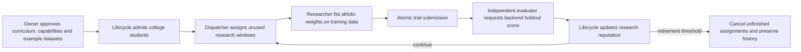

# Bounded research department

> [Current implementation, validation and limits](current-status.md) is the current status index (v0.1.32). Dated milestones and design proposals retain their original scope.

Version 0.1.5 connects the managed student lifecycle to the existing skfolio portfolio backend. This source increment has not been built or run. It follows our organisation's admission, education, evaluation and retirement model. Hermes and Ruflo retain their existing optional roles; this department uses deterministic skfolio methods without a hosted model or model credits.

## Flow and authority



Lifecycle and dispatch are separate policies, both disabled by default. Both must be enabled to assign, claim or submit managed research. Only the owner can alter either policy. Global halt blocks new assignments, claims and submissions. Evaluations of already submitted work may finish while paused or halted; lifecycle changes wait until enabled and resumed.

The dispatcher uses only owner-listed `example-testing` datasets with active verified evidence. Students must be managed, in college, have current reviewed curriculum, and not be awaiting retirement. Each student uses its approved method and has at most one queued/running assignment or submitted trial. Students without recent assignments have priority. A cycle can assign at most one job per eligible student.

The default dispatch budget is 12 assignments per rolling 24 hours and 100 over the installation's lifetime. Owner-set ceilings are 100/day and 1,000 lifetime, with at most 100 approved dataset IDs. Failed and cancelled assignments consume these counts. Revisions never reset the counters. Lowering a cap blocks future allocation; it does not revoke previously issued jobs. Remove a dataset or explicitly cancel a pending assignment to withdraw that work.

All previous assignment and trial holdout periods are excluded for the same student, including failed/cancelled attempts. Overlapping time windows are excluded even if asset names, training observations or dataset IDs differ. Retry an existing lease job rather than relabel a failed exercise. This is a conservative evaluation rule, not a statistical proof of generalisation.

## Execution and recovery

A researcher claims a two-minute lease bound to its principal, assignment and random token. Submission checks the current lease, bot, method, dataset, source validity, curriculum, active policy and halt state. Trial creation and assignment completion are one database transaction. Managed students cannot bypass the queue through a direct portfolio submission. Ordinary owner-created bots retain their existing manual portfolio workflow.

The Python bridge saves fitted weights before submission. Lost responses reuse the exact body and receipt; a reclaimed assignment reuses its saved fit with a new lease receipt. Old lease tokens cannot submit. Three expired attempts mark an assignment failed. Failure is recorded in the audit log and owner inbox but is not a negative skill score. An expired lease is reconciled on the next claim/dispatch cycle, so a stopped installation does not process timers by itself. Pausing blocks execution but does not freeze existing lease clocks.

The evaluator receives trial IDs and asks the backend to calculate holdout scores. Researchers receive training observations, never raw evaluation reports through this queue. Existing training and aggregate community APIs are still available to authorised researchers; this is role separation, not complete information isolation against collusion. Example-data results never confer trading permissions or money.

When retirement becomes pending, queued/running assignments are cancelled and their tokens stop working. Submitted trials still have to be evaluated, revoked or owner-cancelled before archival. Archives retain assignment IDs, attempts, failures and links to submitted trials alongside lessons and lifecycle reviews. Curriculum or dataset evidence revocation blocks submission immediately and cancels outstanding assignments on the next reconciliation.

## Operator setup

1. Rebuild/restart the backend. Startup applies additive migration `006_research_dispatch.sql`; do not change migrations already applied to your database.
2. Follow [research lifecycle](research-lifecycle.md) to approve verified lessons, distinct capability blueprints and lifecycle policy.
3. Register suitable example datasets using [portfolio backend](portfolio-backend.md). Dataset registration alone does not authorise automatic use. Existing offline academy reports are not imported or transformed into graduation evidence.
4. Inspect `npm run lifecycle:admin -- dispatch`. Copy `docs/examples/dispatch-policy.json` to `.local/dispatch-policy.json`, then edit the current revision, real registered IDs and enable setting. The supplied file is disabled; the following illustrates a configured request:

```json
{
  "expectedRevision": 0,
  "rules": {
    "enabled": true,
    "maxAssignmentsPerDay": 12,
    "maxLifetimeAssignments": 100,
    "datasetIds": ["REPLACE_WITH_REGISTERED_DATASET_UUID"]
  }
}
```

Apply it with `npm run lifecycle:admin -- dispatch-policy .local/dispatch-policy.json`. The placeholder above is intentionally invalid until replaced. No source credentials, dataset approvals or policies are created by starting a worker. No new package installation is required when the existing pinned skfolio environment is already present.

For one cycle in separate terminals:

```cmd
npm run worker:department -- evaluator
npm run worker:department -- researcher
```

Run the evaluator again to review a submitted trial. School-to-college admission needs a subsequent lifecycle cycle after its configured cooldown. An idle researcher has no available work; it has not failed.

For a finite continuous session, start these in separate terminals:

```cmd
npm run worker:department -- evaluator --minutes 30
npm run worker:department -- researcher --minutes 30
```

The evaluator reviews, advances lifecycle and dispatches. The researcher claims and fits. This evaluator replaces a separately running `worker:lifecycle` for this workflow. Each launcher passes one role credential to each child, enforces a 110-second per-cycle deadline, and stops after the requested session or three consecutive failed cycles. Maximum session duration is six hours. Ctrl+C stops the active child. Completed fitting does not require an LLM or consume hosted inference credits. These local launchers are not an OS security sandbox; the parent launcher reads owner-managed `.env` configuration.

Inspect `npm run lifecycle:admin -- dispatch`, `-- community` and `-- archives`. Assignments/claims/completions/failures create durable owner inbox events. There is no email, push delivery or browser UI added here. No news feed, autonomous skill invention, automatic code upgrade or live trading has been enabled.

To cancel queued/running work, use `npm run lifecycle:admin -- cancel-assignment <JSON file>` with `{ "assignmentId": "<UUID>", "reason": "<explanation>" }`. For submitted trials use the portfolio cancellation endpoint. To pause, submit a new dispatch policy revision with `enabled:false`, retaining the approved dataset IDs; removing IDs also cancels their pending assignments. Archive and outcome records remain intact.

## API

| Endpoint, under `/v1` | Role | Contract |
| --- | --- | --- |
| GET `/dispatch` | Owner/evaluator | Policy, latest 100 assignments without lease tokens, aggregate state counts. |
| POST `/dispatch/policy` | Owner | `{expectedRevision,rules}`. |
| POST `/dispatch/cycles` | Owner/evaluator | `{}`; reconciles and creates eligible assignments within limits. |
| POST `/dispatch/claims` | Researcher | `{}`; idempotent claim, or idle/disabled/halted. |
| POST `/dispatch/reviews` | Evaluator | Read-only pending trial IDs, at most ten; no idempotency key required. |
| POST `/dispatch/cancellations` | Owner | `{assignmentId,reason}`. |

All mutation routes require an `Idempotency-Key`. `/portfolio/trials` accepts `assignment:{id,leaseToken}`, mandatory for managed students. Claims retried with the same key return the original receipt even if it has since expired; submission still enforces current lease validity. A fresh polling operation needs a fresh key. Schema/authority conflicts must not be retried indefinitely.

## Verification status

Four backend dispatch regression cases were added; lifecycle fixtures now use assignments. A bridge regression case covers fit reuse across changed leases. These tests, compilation, migration and worker execution are **not run**, following the owner's instruction to execute commands themselves. Earlier v0.1.3 build confirmation does not verify v0.1.4 or v0.1.5.

<!-- documentation-navigation -->
[Documentation index](documentation-index.md) · Documentation reconciled for v0.1.32 on 6 October 2026; historical records retain their original scope.
