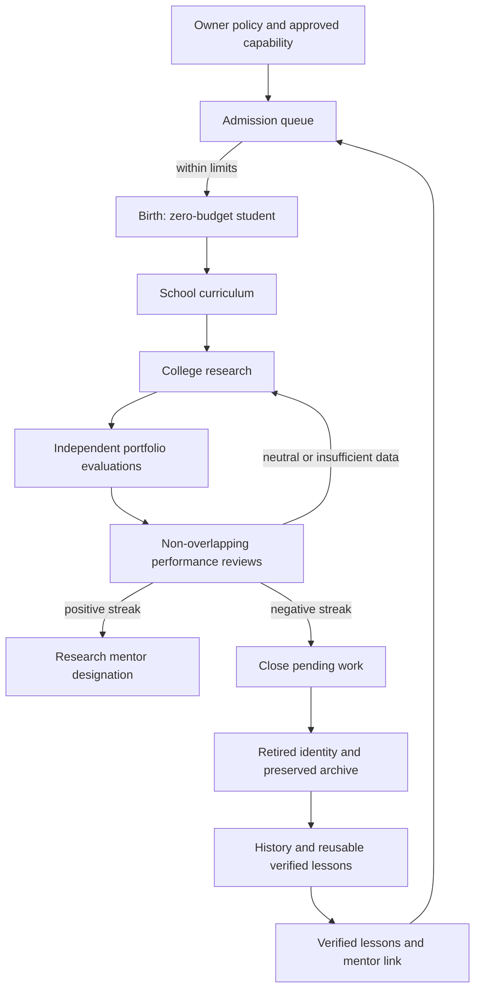

# Our organisation: research bot birth, development and retirement

> Documentation refreshed for v0.1.21 (5 October 2026). [Current implementation, validation and limits](current-status.md). Dated milestones and design proposals retain their original scope.

Version 0.1.4 implements the first governed lifecycle for **example-research students**. It follows the owner's organisation design. Existing repositories supply models, coordination and research methods; they do not define our institution or own its authority. This increment is source code only until the owner builds and runs it.

## Vision and present scope

| Owner's idea | Present implementation | Work still needed |
| --- | --- | --- |
| Birth when a useful opportunity exists | The owner approves an evidence-backed capability blueprint. An enabled cycle admits a zero-budget student within population and birth limits. | Automatic discovery of opportunities and independent assessment of novel contributions. |
| School and college | Students inherit references to independently reviewed lessons. A later cycle checks that curriculum and admits them to college research. | Examinations of actual understanding, new skill acquisition and personalised teaching. Referencing a lesson is not proof of learning it. |
| Distinct work and mentoring | A declared capability key prevents exact renamed duplicates. The blueprint records a mentor and intended contribution. | Semantic duplicate detection, output correlation and measured incremental team value. |
| Rewards and fitness | Backend-calculated portfolio feedback produces positive, neutral or negative reviews and bounded reputation. Sustained positive reviews yield a research-mentor designation. | Department-specific assessments for monitoring, execution, news verification and other roles. |
| Death without wasted knowledge | Repeated negative reviews can retire a managed student after its pending work closes. Identity, lessons, trials, failures and reviews remain linked in an immutable archive. | Generalised handover protocols, successor evaluation and deployment shutdown across separate runtime processes. |
| An expanding community | Community records expose research identity, reputation, speciality, mentor links and lifecycle state. | Autonomous teams/departments, hackathons, the incident court and governed model/code upgrades. |

“Birth” currently creates a database identity and curriculum. It does not launch a separate LLM, mint credentials, train model weights or allocate money. “Death” means leaving active service while retaining accountable history. It never hard-deletes experience. Version 0.1.5 adds a separate [research dispatcher](research-dispatch.md) and department workers: after owner configuration, they assign approved datasets to college students, fit portfolios and request independent evaluation. This code is still unverified.

## Authority and default policy

Lifecycle automation is **disabled by default**. Only the owner can change its rules, approve capability blueprints or withdraw unused approvals. An evaluator can request a cycle only within that stored authority. Enabling this research policy does not enable live trading or change the wallet rules.

Defaults are four active managed students, two births per rolling 24 hours, twenty lifetime managed students, and at most one birth per cycle. Owner-configurable hard ceilings are ten active students, five births per rolling 24 hours and one hundred lifetime students. The blueprint registry is capped at one hundred records, including used/withdrawn entries. A blueprint is used once, so retiring its bot cannot create an endless replacement loop.

Policy updates require the current revision. Every review records the policy revision and rules that produced it. Changing a policy starts a new fitness history for reputation/streak decisions; previous assessments remain archived and their trial periods cannot be reused. Lowering population limits prevents additional births and does not automatically delete existing students.

Every managed bot has `lifecycle_managed=true`, zero trading budget and a database constraint allowing only school, college or retired states. The ordinary momentum graduation path excludes these students, and the paper execution service also rejects them. A mentor designation has no financial authority. Existing owner-created bots remain outside this automatic lifecycle.

## Assessment and rewards

Only independently evaluated portfolio trials with active verified source evidence and backend-calculated reports can count. A managed student may submit only its approved portfolio method. At least three distinct non-overlapping holdout windows are needed for each review. All periods used in any previous review remain consumed, even after evidence is revoked. Repeated polling, a new idempotency key or changing a training window cannot reward the same assessment twice.

The review averages the portfolio diagnostic reward from the configured number of windows:

`(net return - drawdown) minus the equal-weight baseline's same score`

Default outcomes are positive at +50 basis points or higher, negative at -50 or lower, and neutral in between. Positive reviews add ten reputation points, negative reviews subtract ten, and scores are bounded to -100 through +100. Three consecutive positive reviews yield the research-mentor designation; three consecutive negative reviews request retirement. Under default rules this means at least nine non-overlapping windows. These are illustrative example-research rules, not validated financial selection criteria or reinforcement-learning rewards.

No-data cases wait for evidence; they do not count as failure. Neutral reviews break both streaks. Revoked evidence removes the affected review's reward from current reputation and breaks streaks at that review; invalidated observations cannot cause retirement. Reviews and raw historical records remain. The system recomputes current fitness on each enabled cycle, so revocation or policy changes may clear a retirement request before archival.

These rules apply only to portfolio research students. A risk monitor is not judged by this score or retired because it generates no revenue. Revenue-based growth, compute allocation, full confidence calibration and comparative novelty require additional policy and implementation.

## Retirement and community memory

When retirement is pending, the student cannot submit new portfolio work. Queued/running assignments are cancelled and preserved in history; existing evaluations may finish. Open research jobs, pending portfolio trials, reserved orders or holdings prevent archival. The owner can cancel pending portfolio trials using the existing cancellation route. Once work is closed, a cycle archives the student atomically with an audit event and owner notification.

The archive snapshots its identity and owned/inherited lessons, including lesson/evidence validity, and links every portfolio trial and lifecycle review. All original records remain in their tables. Failed experiments are preserved as failed experiments; the archive does not automatically certify them as reusable facts. Shared reviewed lessons remain available through `/v1/knowledge`, subject to current evidence checks. Detailed archives and performance reviews are visible to owner/evaluator roles; researchers receive community-level reputation and existing verified lessons, not raw holdout reports.

The system-wide halt pauses lifecycle cycles. Rule changes, blueprint admissions/blocks, births, school admission, performance reviews, fitness changes and archives create owner inbox entries. An unchanged cycle creates no new audit notification, although its idempotency command receipt remains.



## Terminal operation

No new dependencies are required. Stop the running backend with Ctrl+C, then build and restart it when ready:

```powershell
npm run build
if ($LASTEXITCODE -eq 0) { npm start }
```

Startup applies migration `005_research_lifecycle.sql`. It creates the disabled policy; it does not admit or retire any bot by itself. In a second terminal, from the project directory, inspect it with:

```powershell
npm run lifecycle:admin -- status
npm run lifecycle:admin -- knowledge
npm run lifecycle:admin -- community
```

The admin CLI uses the existing owner credential for explicit owner commands. It accepts HTTPS or loopback HTTP, forbids redirects and has a request timeout. Do not post owner credentials into messages or store them in blueprint files.

To configure a policy later, copy `docs/examples/lifecycle-policy.json` into `.local/lifecycle-policy.json`. Edit `expectedRevision` to the revision returned by `status`, review the limits, and set `enabled` deliberately. The sample stays disabled. Submit the file using:

```powershell
npm run lifecycle:admin -- policy .local/lifecycle-policy.json
```

A blueprint JSON file needs `id`, `name`, `specialty`, `method`, `contribution`, `evidenceId`, `lessonIds`, and optionally `mentorId`. Method is `equal_weight`, `inverse_volatility` or `minimum_variance`. Evidence and lesson IDs must already exist and be independently verified. The department is fixed to research. Submit with:

```powershell
npm run lifecycle:admin -- blueprint .local/student-blueprint.json
```

The first enabled cycle can admit the student; the next eligible cycle can admit it to college. The worker uses only the evaluator credential and cannot change the policy or approve new blueprints:

```powershell
# One cycle, then exit:
npm run worker:lifecycle
# Or supervise cycles for up to two hours:
npm run worker:lifecycle -- --minutes 120
```

The duration is bounded to six hours and the worker waits at least sixty seconds between requests. It exits on disabled/ halted policy or exhausted connection retries. Ctrl+C stops it. It does not run automatically when the backend starts, install an OS service, use Codex scheduling, or call a model API. A running local worker can continue without this chat, provided the computer and backend stay on.

Withdrawal files take `{blueprintId,reason}` and are submitted with `lifecycle:admin -- withdraw <file>`. Detailed archive records can be read with `lifecycle:admin -- archives`.

## Verification status

The assistant has written regression tests for authority, paused operation, duplicate capability declarations, zero-budget constraints, repeat polling, positive/negative review streaks, evidence revocation, knowledge preservation and retirement draining. **They have not been executed**, as the owner is handling terminal execution and has deferred testing. The current Node backend suite includes them when the owner later chooses to run it. No new test results are claimed.
