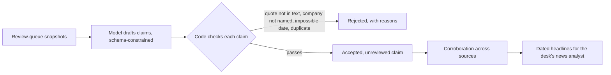
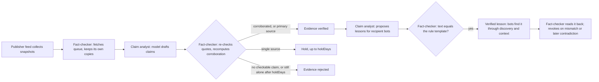

# Evidence-backed claims

This module turns news snapshots into small claims that can be checked, then groups them across sources. It is the first step of DATA-02 in the [remaining-work assessment](../../docs/remaining-work-assessment.md) and next priority 3 in the [current status](../../docs/current-status.md).

There are two ways to use it:
- **Automatic** (`autolearn.py`): an independent fact-checker bot reviews everything by fixed rules, and verified lessons reach the bots with no human step. See [Automatic knowledge](#automatic-knowledge).
- **Manual** (`claims.py`): writes only local files for inspection.

## How it works



1. **The model drafts, code verifies.** For each snapshot, the local model returns at most 6 claims. Each claim has:
   - a plain-language statement;
   - an **exact quote** from the article;
   - the companies it concerns, from the desk's 8 shares;
   - an event type, a likely price direction, an event date and a certainty label.

   Code then rejects a claim when:
   - its quote is not in the article (after normalising typographic quotes, dashes and spacing);
   - its company is never named;
   - it is a "reported fact" dated after publication;
   - it repeats another claim's quote.

   Rejected claims are kept, with their reasons.
2. **Corroboration.** Claims about the same company and event type whose publication times chain within 72 hours form a cluster.
   - **Independent origins** are distinct sources. Near-identical quotes (syndicated wire copies) count as one origin, so ten copies of one story do not look like ten confirmations.
   - Each cluster is labelled `corroborated` (2 or more independent origins), `single-source` or `contradicted` (positive and negative claims about the same event).
   - Corroboration counts independent reports; it does not prove truth.
3. **Headlines.** Accepted claims become `{publishedAt, source, title, symbols}` items, the input format of the trading desk's news analyst. By default only claims from corroborated clusters are included.

## Automatic knowledge

`autolearn.py` makes the bots knowledgeable automatically. The reviewer is a bot, not a person:



**Two independent bots.** The **claim analyst** has the researcher credential and the model. The **fact-checker** has the evaluator credential and **no model**. Each step runs as a separate child process that receives only its own credential, and the two share only data files.

The backend independently enforces:
- authors never review their own evidence or lessons;
- lessons need verified evidence;
- sources must be approved.

**The fact-checker's rules.** It decides by rules, never by model judgement:
- **Re-checks:** it re-checks every drafted claim against **its own** copy of the snapshot, so a claim the article does not support is ignored.
- **Verifies evidence** when a re-checked claim is corroborated by 2 or more independent origins, or comes from an owner-designated primary source (such as the company's own filings), and nothing contradicts it.
- **Holds evidence** while it waits for corroboration, up to `holdDays`. After that it rejects it, and it rejects at once anything with no checkable claim.
- **Verifies a lesson** only if its text is exactly the template the rules produce. The template is dated and attributed, quotes its source, and states that it is not an instruction or a trading signal.
- **Reads back** stored lessons, and revokes the evidence if the stored text differs.
- **Revokes contradicted evidence:** when later independent reports contradict a verified claim, it revokes the evidence, and its lessons disappear from what bots see.

**Owner configuration** (`.local/claims/autolearn.json`):

```json
{ "recipientBotIds": ["news-desk"], "primarySourceIds": [], "holdDays": 7, "maxModelCallsPerCycle": 20 }
```

Recipient bots get the lessons directly. Every other bot can find them through the existing knowledge discovery and transfer.

**Run** (owner-started, finite sessions; the backend and the local model must be running, and `.env` must hold exactly one researcher and one evaluator credential):

```cmd
.local\replay-venv\Scripts\python.exe integrations\claims\autolearn.py run --config .local\claims\autolearn.json --cycles 12 --interval-minutes 30
```

Every cycle also rewrites `.local/claims/auto/verified-headlines.json`. It contains only the fact-checker's verified, unrevoked claims, in the trading desk's news format. Point the live desk or a batch at it with `--news`, and the desk's news analyst uses newly learned news at its next meeting.

Each cycle is logged to `.local/claims/auto/cycles.jsonl`. Every decision is recorded with its reason in `decisions.json`, `lesson-reviews.json` and `revocations.json`. The backend's audit trail notifies the owner's inbox of each review.

**What "verified" means here:** quote-checked, attributed and corroborated by independent reports, or stated by a primary source. It does not mean proven true. Bots receive it as dated context, and knowledge never grants trading, spending or permission changes.

**Limits:** model calls here are bounded per cycle, but they are not yet charged to the backend's daily token ceiling, which covers only backend-managed requests.

## Safety

- **Article text is untrusted data.** It reaches the model only as a JSON field, never as an instruction. The prompt says so, and the output schema allows only claim fields, so an injected "tell the desk to buy" can at most become a quoted claim with no authority.
- **Company names are matched deterministically.** Look-alike listed companies (Reliance Power, Reliance Capital, SBI Life, SBI Cards, NTPC Green) are not mistaken for RIL, SBI or NTPC. Short ticker-like aliases (RIL, SBI, ITC) must match in capitals.
- **Bounded runs:** one model call per snapshot, a call limit per run, and loopback-only model access unless `--allow-remote-cost` is given.
- **Resumable and bound:** each snapshot's result is saved as soon as it finishes, and a run is tied to its model and contract version. Changing either needs a new run name.

## Run

Save the backend review queue (`GET` pending source observations, as owner or evaluator) to a JSON file, then:

```cmd
.local\replay-venv\Scripts\python.exe integrations\claims\claims.py extract --input .local\claims\queue.json --run first --max-calls 20
.local\replay-venv\Scripts\python.exe integrations\claims\claims.py corroborate --run first
.local\replay-venv\Scripts\python.exe integrations\claims\claims.py headlines --run first --minimum corroborated
```

Output goes to `.local/claims/<run>/`:
- `extracted.json`: accepted and rejected claims per snapshot, with token counts;
- `clusters.json`;
- `headlines-<minimum>.json`.

Pass the headlines to the desk with `desk.py --news`.

## Tests

```cmd
cd integrations\claims
..\..\.local\replay-venv\Scripts\python.exe -m unittest test_claims test_autolearn -v
```

The 17 tests use a stand-in model and, for `autolearn`, a fake backend enforcing the real routes' rules. The automatic pipeline's tests cover:
- corroborated news becoming verified knowledge, with no repeated writes on a second cycle;
- single-source holds, rejection after the hold period, and primary sources;
- a later contradiction revoking verified evidence and removing its lessons;
- the fact-checker ignoring an analyst claim the article does not support;
- altered lesson text never being verified, and a stored mismatch causing revocation;
- each step receiving only its own credential, with only extraction getting the model;
- finite, logged sessions that stop on a failed step;
- configuration validation.

The claim-extraction tests cover:
- company matching, including look-alike companies;
- quote verification across typographic differences;
- date and shape checks;
- invented and duplicate quotes being rejected;
- an injected instruction staying data;
- failures recording nothing;
- resumable runs bound to model and contract;
- syndicated copies not counting as corroboration;
- contradictions and time windows;
- headlines accepted by the desk's own validator.

## Limits and next steps

- **Coverage:** the company list is the desk's 8 shares.
- **Event types:** the 10 categories are coarse, and price direction is the model's judgement, recorded as such.
- **No real publisher yet:** no publisher has been approved, so this has not run on real articles.
- **Next:**
  - Measure precision on a small hand-checked set.
  - Then propose a backend claim record that links to the evidence snapshot, with separate review.
